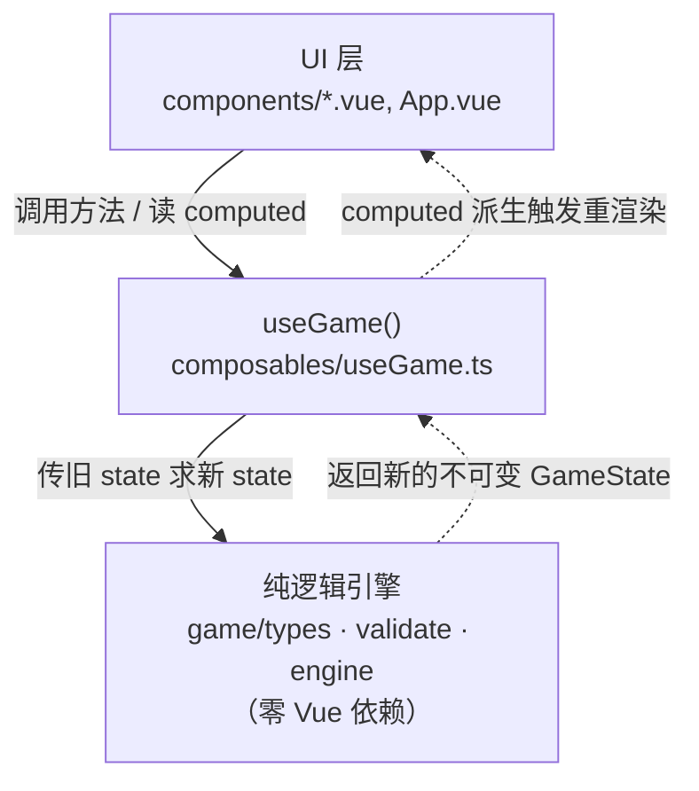
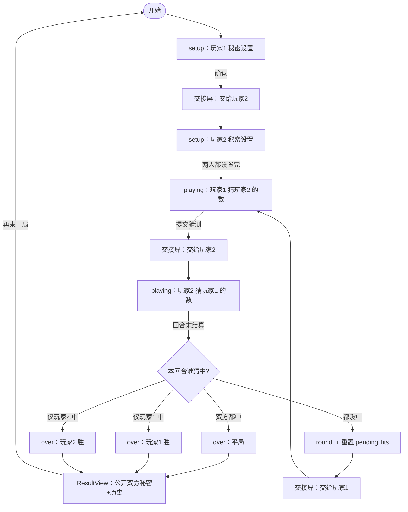

# L1 · 整体概览

> 文档层级：**L1（鸟瞰）** → [L2 各部分职责](./L2-components/) → [L3 关键细节](./L3-details/) → [L4 逐文件 API](./L4-api/)

## 这是什么

**双人热座猜数字游戏**：两名玩家在**同一台电脑**上轮流操作，各自秘密设置一个 **N 位（默认 4 位）、每位互不相同**的数字；随后轮流猜对方的数字。每次猜测后只得到一个提示数字 —— **Bulls**（有几个位置上的数字完全正确，不告知是哪几位）。**先在一个完整回合里全部猜中者获胜；若同一回合双方都猜中则平局。**

一句话：*热座双人、N 位互不相同、Bulls 提示、先全中者胜可平局。*

```
答案 0891，猜 0290 → 位置1(0✓)、位置3(9✓) → 提示 2
答案 1234，猜 1234 → 全部命中           → 提示 4（达到 N，命中）
```

## 架构分层图

整个系统严格分三层，**依赖方向自上而下单向**；最底层的纯逻辑引擎**零 Vue 依赖**，可被 Vitest 独立穷尽测试。

```
┌──────────────────────────────────────────────────────────┐
│  UI 层  src/components/*.vue + App.vue                     │
│  职责：显示画面、收集输入、本地交接屏状态                  │
│  依赖：Vue 3 + useGame()                                   │
└───────────────────────────┬──────────────────────────────┘
                            │ 调用方法 / 读取 computed
                            ▼
┌──────────────────────────────────────────────────────────┐
│  组合式层  src/composables/useGame.ts                     │
│  职责：把纯引擎接入 Vue 响应式（ref/computed）            │
│  依赖：Vue 3 + game/                                       │
└───────────────────────────┬──────────────────────────────┘
                            │ 调用纯函数，传入旧 state 得新 state
                            ▼
┌──────────────────────────────────────────────────────────┐
│  纯逻辑引擎  src/game/{types,validate,engine}.ts          │
│  职责：类型 · 校验 · 算提示(Bulls) · 回合状态机 · 判胜负  │
│  依赖：★ 零 Vue 依赖 ★（纯 TypeScript，可独立测试）       │
└──────────────────────────────────────────────────────────┘
```

依赖方向：**UI → useGame → engine**。引擎从不反向 import Vue 或组件；UI 也从不直接修改 state，只能经 `useGame` 暴露的方法。



## 三阶段流程图

游戏状态机有三个阶段：`setup`（轮流秘密设置）→ `playing`（轮流猜，每次轮换插入交接屏）→ `over`（公布胜负 / 平局）。



ASCII 版（同一流程）：

```
setup_p1 --确认--> 交接屏 --> setup_p2 --两人都设--> playing
playing:  P1 猜 --交接--> P2 猜 --回合末结算-->
              双中     → over: 平局
              仅 P1 中 → over: P1 胜
              仅 P2 中 → over: P2 胜
              都没中   → round++，回到 P1 猜（前插交接屏）
over --再来一局--> setup_p1
```

**公平性**：先手（P1）即使先猜中也**不立即结束**，要等 P2 在同一回合也猜一次后才统一结算，从而保证双方猜测次数始终相等（详见 [L3 状态机](./L3-details/state-machine.md)）。

## 目录总览

| 目录 / 文件 | 职责 |
|-------------|------|
| `src/game/` | **纯逻辑引擎（零 Vue）**：`types.ts` 类型、`validate.ts` 校验、`engine.ts` 算提示与状态机。可被 Vitest 独立穷尽测试。 |
| `src/composables/` | `useGame.ts` 组合式封装：用 `ref/computed` 把引擎接入 Vue 响应式，向 UI 暴露 state 与方法。 |
| `src/components/` | UI 组件：`App.vue` 之下的 `SetupView / SecretInput / PlayView / GuessInput / HistoryList / HandoffScreen / ResultView`。 |
| `src/App.vue` `src/main.ts` | 应用根：`App.vue` 依 `phase` 渲染三视图；`main.ts` 挂载到 `#app`。 |
| `docs/` | 分层文档 L1–L4（本目录）与设计 spec（`docs/superpowers/`）。 |
| `.github/workflows/` | GitHub Actions：构建并部署到 GitHub Pages（由 Task 13 落地，详见 [L2 部署](./L2-components/deploy.md)）。 |

## 如何运行

> 环境为 Arch Linux，依赖装在项目本地 `node_modules`，**安装命令请手动执行**。

```bash
npm install      # 安装依赖（首次）
npm run dev      # 本地开发服务器（Vite）
npm run test     # 跑 Vitest 单元/组件测试
npm run build    # 类型检查(vue-tsc) + 生产构建到 dist/
```

| 命令 | 作用 |
|------|------|
| `npm run dev` | 启动 Vite 开发服务器，热更新 |
| `npm run test` | `vitest run` 一次性跑全部测试 |
| `npm run test:watch` | 监听模式跑测试 |
| `npm run build` | `vue-tsc --noEmit && vite build`，产物在 `dist/` |
| `npm run preview` | 本地预览构建产物 |

## 下钻阅读

- [L2 · 引擎层](./L2-components/engine.md) ｜ [L2 · UI 层](./L2-components/ui.md) ｜ [L2 · 部署](./L2-components/deploy.md)
- [L3 · 状态机](./L3-details/state-machine.md) ｜ [L3 · 保密交接](./L3-details/handoff.md) ｜ [L3 · 校验](./L3-details/validation.md)
- [L4 · engine API](./L4-api/engine.md) ｜ [validate API](./L4-api/validate.md) ｜ [useGame API](./L4-api/useGame.md) ｜ [components API](./L4-api/components.md)
