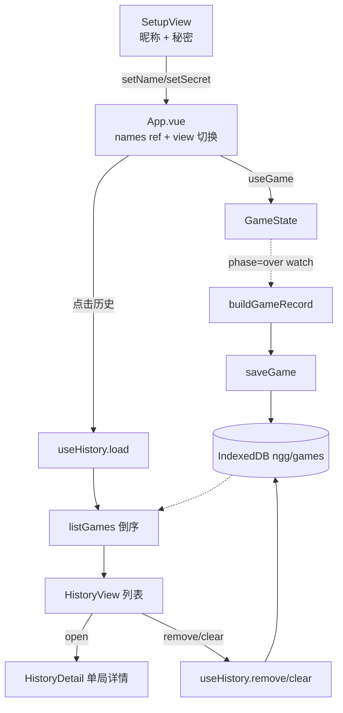

# L2 · 本地对局历史模块（`src/history/` + `useHistory` + `HistoryView/Detail`）

> 上层：[L1 概览](../L1-overview.md) ｜ 下钻：[L3 历史存储](../L3-details/history-storage.md) · [L4 history API](../L4-api/history.md) · [L4 components API](../L4-api/components.md) ｜ 源码：`src/history/*` · `src/composables/useHistory.ts` · `src/components/HistoryView.vue` · `src/components/HistoryDetail.vue`

纯前端的对局历史：每局结束**自动**存入浏览器 IndexedDB，可在历史视图浏览 / 删除 / 清空，详情展示双方数字与完整猜测记录。与对局引擎（engine/useGame）**完全解耦**——是一层可选增强，不参与任何对局规则。

## 组成

| 单元 | 文件 | 职责 |
|------|------|------|
| 数据类型 | `src/history/types.ts` | `GameRecord` 结构（含双方昵称 / 秘密 / 双历史 / 结局） |
| 存储层 | `src/history/store.ts` | IndexedDB 封装：`saveGame` / `listGames` / `getGame` / `deleteGame` / `clearAll` |
| 记录组装 | `src/history/record.ts` | 纯函数 `buildGameRecord` + `newId`（从 `GameState` 组装一条记录） |
| 响应式封装 | `src/composables/useHistory.ts` | `records` / `error` + `load` / `remove` / `clear` |
| 列表视图 | `src/components/HistoryView.vue` | 展示列表（props 进、事件出，含删除/清空确认） |
| 详情视图 | `src/components/HistoryDetail.vue` | 单局详情（复用 `HistoryList` ×2 展示双方猜测） |

逐文件签名见 [L4 history API](../L4-api/history.md)，两个视图的 props / emits 见 [L4 components API](../L4-api/components.md)。

## 数据流

`App.vue` 在 setup 阶段收集可选昵称（`names`），对局结束（`phase → over`）时 watch 触发保存；点「历史」进入列表/详情视图。

```
SetupView(昵称+秘密) ─emit setName/setSecret─► App(names ref) ─► useGame(state)
   phase → over ─watch─► buildGameRecord(state, names) ─► saveGame ─► IndexedDB
App：点击「📜 历史」 ─► useHistory.load ─► listGames ─► HistoryView（倒序列表）
     点某行 ─► HistoryDetail（公开双方数字 + 红蓝双方完整猜测）
     行内「删除」/「清空历史」─► useHistory.remove / clear（带 confirm 二次确认）
```



## 与对局引擎的边界

- 历史模块**只读** `GameState`（经 `buildGameRecord`），从不反向修改对局状态。
- `src/history/store.ts` 不依赖 Vue；`useHistory.ts` 才把它接入 `ref`。
- 引擎 / `useGame` 对历史模块**一无所知**，删掉整个 `src/history/` 也不影响对局可玩性。

## 降级（历史是增强功能）

IndexedDB 不可用（隐私模式 / jsdom 无实现）或某次操作失败时，**游戏照常进行**，仅以内联提示告知，不抛错、不阻塞：

| 时机 | 文案 | 显示位置 |
|------|------|----------|
| 保存失败 | `历史保存失败（可能是浏览器隐私模式）` | 结果页 `ResultView`（`saveError`） |
| 读取失败 | `历史读取失败` | 历史列表横幅（`useHistory.error`） |
| 删除失败 | `历史删除失败` | 历史列表横幅 |
| 清空失败 | `历史清空失败` | 历史列表横幅 |

错误横幅与列表**非互斥**：读失败时列表退化为空 + 横幅；写（删/清）失败时**保留原列表**并叠加横幅。空态提示「还没有历史记录」仅在**无记录且无错误**时显示。
