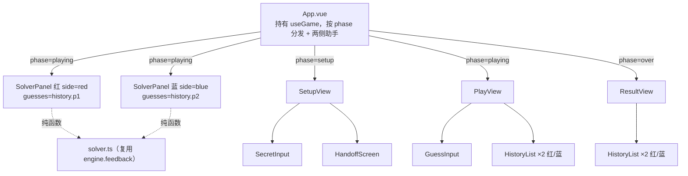

# L2 · UI 层（`src/components/` + `App.vue`）

> 上层：[L1 概览](../L1-overview.md) ｜ 下钻：[L3 保密交接](../L3-details/handoff.md) · [L3 推理引擎](../L3-details/solver.md) · [L4 components API](../L4-api/components.md) · [L4 useGame API](../L4-api/useGame.md)

## 定位

UI 层只负责**显示画面**与**收集输入**，所有规则交给引擎。`App.vue` 持有 `useGame()`，依 `phase` 渲染三大视图之一。组件之间靠 props 向下传、emits 向上传，**严格单向数据流**。

> **红蓝改版**：原「玩家1 / 玩家2」一律改称**红方 / 蓝方**（`p1`→红、`p2`→蓝，见 `src/playerLabels.ts`）。整页背景随当前方着红 / 蓝色（`App.vue` 的 `stage` 上 `:class="side-${activeSide}"`）。

## 三栏布局

`App.vue` 外层 `.stage > .table`，按 `phase` 决定列数：

- **playing**：左 = 红方助手 `SolverPanel(side="red")`，中 = `<main>` 卡片（PlayView），右 = 蓝方助手 `SolverPanel(side="blue")`。两侧助手仅猜测阶段出现。
- **setup / over**：只有中间卡片（SetupView / ResultView），两侧助手不渲染。

```text
playing：  [🔴 红方助手]   [ 中央卡片：PlayView ]   [🔵 蓝方助手]
setup/over：               [ 中央卡片：Setup/Result ]
```

## 组件树

```
App.vue                  根：持有 useGame()，依 phase 渲染对应视图 + 两侧助手
│
├─ SolverPanel.vue ×2    playing 阶段左右两侧（红/蓝）；4×10 推理网格，默认收起
│
├─ SetupView.vue         setup 阶段：轮流秘密输入 + 交接屏
│   ├─ SecretInput.vue   单个秘密输入框（实时校验、可隐藏为 ●）
│   └─ HandoffScreen.vue 交接屏（红方→蓝方）
│
├─ PlayView.vue          playing 阶段：当前方猜测 + 红蓝双历史常驻（无交接屏）
│   ├─ GuessInput.vue    猜测输入（实时校验）
│   └─ HistoryList.vue ×2 红方 / 蓝方历史（「正确数目 N」，可复用）
│
└─ ResultView.vue        over 阶段：公布胜负/平局 + 公开双方秘密 + 再来一局
    └─ HistoryList.vue ×2 复用：分别展示红蓝完整历史
```



## 每个组件一句话职责

| 组件 | 职责 |
|------|------|
| `App.vue` | 根组件，调用 `useGame()`，按 `phase` 渲染 SetupView / PlayView / ResultView 并接线方法；playing 阶段在中央卡片左右各挂一个 `SolverPanel`（红/蓝）；`stage` 背景按当前方红/蓝着色。 |
| `SolverPanel.vue` | 4×10 推理助手（红蓝复用），基于该方猜测历史自动枚举排除、支持假设/划除做 what-if，本地 `assumptions`/`crossedOut`/`expanded`，默认收起。详见 [L3 推理引擎](../L3-details/solver.md)。 |
| `SetupView.vue` | 编排 setup 阶段三步：红方输入 → 交接屏 → 蓝方输入；向上 emit `setSecret`。 |
| `SecretInput.vue` | 单个秘密输入框，实时校验、可切换 `password`/`text` 隐藏显示，确认后清空。 |
| `HandoffScreen.vue` | 通用交接屏，显示一条提示与一个继续按钮，emit `continue`。**仅 setup 阶段使用**（红方→蓝方）。 |
| `PlayView.vue` | 编排 playing 阶段：当前方猜测输入 + **红蓝双历史常驻**（无交接屏）；emit `guess`。 |
| `GuessInput.vue` | 猜测输入框，实时校验，提交后清空。 |
| `HistoryList.vue` | 纯展示一串 `GuessRecord`（猜测 + 「正确数目 N」），可带标题与红/蓝主题，可复用。 |
| `ResultView.vue` | 结束屏：显示「红方获胜！/蓝方获胜！/平局！」、公开双方秘密与完整历史、emit `playAgain`。 |

逐组件 props / emits 见 [L4 components API](../L4-api/components.md)。

## 单向数据流

```
用户在输入框键入
   │  @input → onInput()（过滤+回写）
   ▼
组件 emit（confirm / guess / setSecret …）
   │
   ▼
App 调用 useGame 方法（applySecret / applyGuess / reset）
   │
   ▼
引擎纯函数算出新的不可变 state
   │  state.value = 新对象
   ▼
useGame 的 computed（phase/current/round/outcome/config）派生更新
   │
   ▼
App 依新 phase 重渲染对应视图
```

```mermaid
flowchart LR
    Input[输入框] -->|emit| Comp[子组件]
    Comp -->|@event| App[App.vue]
    App -->|applySecret/applyGuess/reset| Hook[useGame 方法]
    Hook -->|纯函数| Engine[engine]
    Engine -->|新 state| State[state.value]
    State -->|computed| Derived[phase/current/round/outcome]
    Derived -->|重渲染| Input
```

**UI 永不直接修改引擎状态**，只经 `useGame` 暴露的方法；校验文案来自引擎 `ValidationResult.error`。

## 交接屏（仅 setup 阶段）

`HandoffScreen.vue` 是**通用组件**，目前只在 **setup 阶段**（`SetupView`）使用：红方确认后 `step='handoff'`，显示「请把电脑交给蓝方，准备好后点击开始」。

> **红蓝改版**：猜测（playing）阶段**已去掉每次轮换的交接屏**，改为双方同屏、红蓝**双历史常驻**（`PlayView` 同时展示 `history.p1`/`history.p2`）。当前方靠整页红/蓝背景与输入框标题区分。

它只接收 `message` / 可选 `buttonText`，emit `continue`，不含任何游戏逻辑。详见 [L3 保密交接](../L3-details/handoff.md)。

## 关键约定

### 1. 禁止 `v-html`

所有动态内容一律用 `{{ }}` 文本插值（如 `HistoryList` 的 `{{ r.guess }}`、`ResultView` 的秘密公开），**绝不使用 `v-html`**，杜绝 XSS。

### 2. 输入框用「`:value` + `@input` DOM 回写」而非 `v-model`

`SecretInput` / `GuessInput` 没有用 `v-model`，而是：

```vue
<input :value="value" @input="onInput" />
```

```typescript
function onInput(e: Event) {
  const el = e.target as HTMLInputElement
  const clean = el.value.replace(/[^0-9]/g, '').slice(0, props.digits)
  value.value = clean   // 更新响应式
  el.value = clean      // 同步回写 DOM，避免受控输入光标/残留字符 bug
}
```

当用户键入非法字符（如字母）时，过滤后的 `clean` 可能与 Vue 内部记录的旧值相同，导致 `:value` 不触发更新、DOM 里残留非法字符。**手动 `el.value = clean` 回写**确保输入框始终只显示过滤后的数字，避免受控输入的边界 bug。

## 模式选择与人机对战（pve）

开局先渲染 `ModeSelect.vue`（`gameMode===null` 时，置于 `<main>` 内、保留顶部标题与历史入口）：

- **双人(热座)**：`emit('select','pvp')` → 进入原 SetupView 红蓝轮流流程。
- **人机对战**：展开难度（简单/普通/困难）→ `emit('select','pve', 难度)`。

`App.vue` 持有 `gameMode`/`botDifficulty`，pve 下：

- `SetupView :vs-bot` 只走玩家一步（确认后不进交接屏，等 App 自动设 bot 秘密）。
- `PlayView :bot-turn` 在 bot 回合隐藏玩家输入、显示「🤖 电脑思考中…」。
- bot 由两个 watch 驱动（自动设秘密 + 延迟出招），engine 不变。详见 [L3 人机对战策略](../L3-details/bot-strategy.md)、[L4 bot API](../L4-api/bot.md)。

再战回到模式选择（`gameMode=null`，保留昵称），统一 `clearBotTimer()` 防串台。
