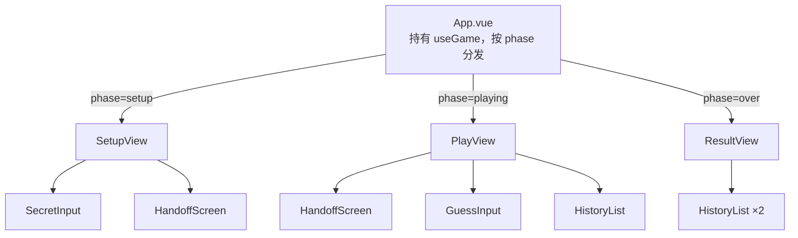

# L2 · UI 层（`src/components/` + `App.vue`）

> 上层：[L1 概览](../L1-overview.md) ｜ 下钻：[L3 保密交接](../L3-details/handoff.md) · [L4 components API](../L4-api/components.md) · [L4 useGame API](../L4-api/useGame.md)

## 定位

UI 层只负责**显示画面**与**收集输入**，所有规则交给引擎。`App.vue` 持有 `useGame()`，依 `phase` 渲染三大视图之一。组件之间靠 props 向下传、emits 向上传，**严格单向数据流**。

## 组件树

```
App.vue                  根：持有 useGame()，依 phase 渲染对应视图
│
├─ SetupView.vue         setup 阶段：轮流秘密输入 + 交接屏
│   ├─ SecretInput.vue   单个秘密输入框（实时校验、可隐藏为 ●）
│   └─ HandoffScreen.vue 交接屏（P1→P2）
│
├─ PlayView.vue          playing 阶段：当前玩家猜测 + 自己的历史
│   ├─ HandoffScreen.vue 交接屏（每次轮换复用）
│   ├─ GuessInput.vue    猜测输入（实时校验）
│   └─ HistoryList.vue   猜测+提示历史列表（可复用）
│
└─ ResultView.vue        over 阶段：公布胜负/平局 + 公开双方秘密 + 再来一局
    └─ HistoryList.vue   复用：分别展示双方完整历史
```



## 每个组件一句话职责

| 组件 | 职责 |
|------|------|
| `App.vue` | 根组件，调用 `useGame()`，按 `phase` 渲染 SetupView / PlayView / ResultView 并接线方法。 |
| `SetupView.vue` | 编排 setup 阶段三步：P1 输入 → 交接屏 → P2 输入；向上 emit `setSecret`。 |
| `SecretInput.vue` | 单个秘密输入框，实时校验、可切换 `password`/`text` 隐藏显示，确认后清空。 |
| `HandoffScreen.vue` | 通用交接屏，显示一条提示与一个继续按钮，emit `continue`。setup 与 playing 复用。 |
| `PlayView.vue` | 编排 playing 阶段：交接屏 → 猜测输入 + 当前玩家自己的历史；emit `guess`。 |
| `GuessInput.vue` | 猜测输入框，实时校验，提交后清空。 |
| `HistoryList.vue` | 纯展示一串 `GuessRecord`（猜测+提示），可带标题，可复用。 |
| `ResultView.vue` | 结束屏：显示胜负/平局文案、公开双方秘密与完整历史、emit `playAgain`。 |

逐组件 props / emits 见 [L4 components API](../L4-api/components.md)。

## 单向数据流

```
用户在输入框键入
   │  @input → onInput()（过滤+回写）
   ▼
组件 emit（confirm / guess / setSecret …）
   │
   ▼
App 调用 useGame 方法（applySecret / applyGuess / reset）
   │
   ▼
引擎纯函数算出新的不可变 state
   │  state.value = 新对象
   ▼
useGame 的 computed（phase/current/round/outcome/config）派生更新
   │
   ▼
App 依新 phase 重渲染对应视图
```

```mermaid
flowchart LR
    Input[输入框] -->|emit| Comp[子组件]
    Comp -->|@event| App[App.vue]
    App -->|applySecret/applyGuess/reset| Hook[useGame 方法]
    Hook -->|纯函数| Engine[engine]
    Engine -->|新 state| State[state.value]
    State -->|computed| Derived[phase/current/round/outcome]
    Derived -->|重渲染| Input
```

**UI 永不直接修改引擎状态**，只经 `useGame` 暴露的方法；校验文案来自引擎 `ValidationResult.error`。

## 交接屏复用

`HandoffScreen.vue` 是**通用组件**，在两处复用：

- **setup 阶段**（`SetupView`）：P1 确认后 `step='handoff'`，显示「请把电脑交给玩家2」。
- **playing 阶段**（`PlayView`）：每次猜测后 `awaitingHandoff=true`，显示「请把电脑交给【下一玩家】，准备好后开始第 N 回合的猜测」。

它只接收 `message` / 可选 `buttonText`，emit `continue`，不含任何游戏逻辑。详见 [L3 保密交接](../L3-details/handoff.md)。

## 关键约定

### 1. 禁止 `v-html`

所有动态内容一律用 `{{ }}` 文本插值（如 `HistoryList` 的 `{{ r.guess }}`、`ResultView` 的秘密公开），**绝不使用 `v-html`**，杜绝 XSS。

### 2. 输入框用「`:value` + `@input` DOM 回写」而非 `v-model`

`SecretInput` / `GuessInput` 没有用 `v-model`，而是：

```vue
<input :value="value" @input="onInput" />
```

```typescript
function onInput(e: Event) {
  const el = e.target as HTMLInputElement
  const clean = el.value.replace(/[^0-9]/g, '').slice(0, props.digits)
  value.value = clean   // 更新响应式
  el.value = clean      // 同步回写 DOM，避免受控输入光标/残留字符 bug
}
```

当用户键入非法字符（如字母）时，过滤后的 `clean` 可能与 Vue 内部记录的旧值相同，导致 `:value` 不触发更新、DOM 里残留非法字符。**手动 `el.value = clean` 回写**确保输入框始终只显示过滤后的数字，避免受控输入的边界 bug。
