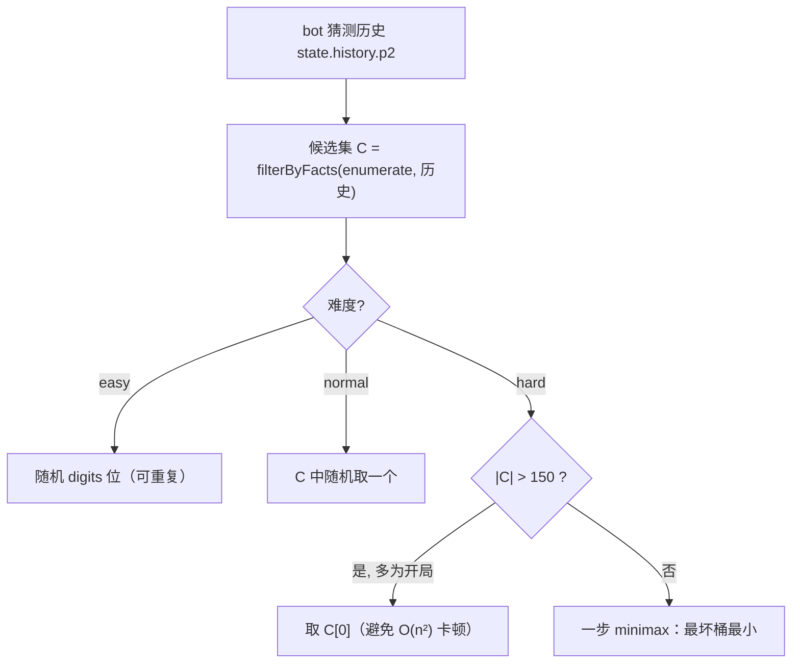
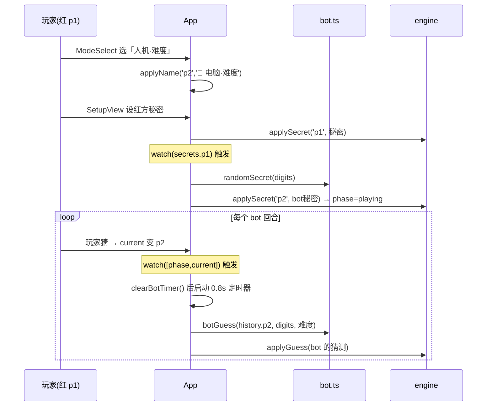

# L3 · 人机对战策略（Bot）

> 上层：[L1 概览](../L1-overview.md) · [L2 UI 层](../L2-components/ui.md) ｜ 下钻：[L4 bot API](../L4-api/bot.md) ｜ 源码：`src/game/bot.ts`
>
> 关联设计：[bot-opponent-design spec](../superpowers/specs/2026-06-23-bot-opponent-design.md)

## 这是什么

开局可选「双人(热座) / 人机对战」。人机模式下玩家固定先手（红方 p1），电脑为蓝方 p2，复用推理助手同款 solver 候选枚举来「猜」玩家的秘密数。引擎完全不知道 bot 的存在——bot 由 `App.vue` 在**应用层**用两个 watch 驱动，engine 保持纯净。

## 三档难度

| 难度 | 策略 | 候选利用 | 体验 |
|------|------|----------|------|
| 简单 easy | 纯随机猜（每位 0-9，可重复） | 不用候选 | 几乎不会赢，轻松玩 |
| 普通 normal | 从「与历史自洽的候选集」随机挑一个 | 用候选、绝不重复犯错 | 稳定收敛，像普通人 |
| 困难 hard | 一步 minimax：选「最坏剩余候选最小」的猜测 | 候选 + 信息论最优分割 | 残局精准、收敛最快 |

> 普通/困难都**只从候选集出招**——既是可能的真值（能直接命中），又保证每一步都与历史一致。

## 候选从哪来

bot(p2) 对玩家秘密的猜测历史 = `state.history.p2`。候选集即：

```text
C = filterByFacts(enumerateCandidates(digits), state.history.p2)
  = 所有「与 bot 至今每一手的正确数目都吻合」的互异数
```

随着 bot 不断猜、拿到反馈，C 单调收窄，直到只剩玩家的秘密。

## 选猜流程



## 困难档：一步 minimax

对候选集 C 里每个候选 `g`，假设用它去猜，会按「正确数目」把 C 分成若干桶；最坏情况剩下的候选数 = 最大的那个桶。选「最坏桶最小」的 g —— 最坏情况下也能把候选砍得最狠。

```text
minimax(C):
  best, bestWorst = C[0], +∞
  for g in C:                      # 每个候选都试着当「这一手」
    buckets = {}                   # feedback 值 → 命中该 feedback 的候选数
    for s in C:                    # 假设真值是 s
      f = feedback(s, g)
      buckets[f] += 1
    worst = max(buckets.values())  # 这一手最坏会剩多少候选
    if worst < bestWorst:          # 严格小于 → 平局保留候选序最前者（确定性）
      best, bestWorst = g, worst
  return best
```

### 为什么有 150 阈值

minimax 是 `O(|C|²)` 次 `feedback`。开局 `|C|=5040`，平方约 2540 万次会让 UI 卡顿；而拿到一两手反馈后 C 迅速跌破 150。故 `|C| > 150` 时先取 `C[0]`（任一候选都能继续收窄），`|C| ≤ 150` 起启用 minimax（≤150²=22500 次 feedback，亚毫秒）。

## 应用层如何驱动（engine 不改）



- `watch(secrets.p1)`：玩家设秘密后自动给 bot 设随机秘密 → 进入对战。
- `watch([phase,current])`：轮到 p2 时延迟 ~0.8s 出招（其间 PlayView 显示「🤖 电脑思考中…」、隐藏玩家输入）；每次先 `clearBotTimer()` 防重入；`playAgain`/`onUnmounted` 也清理，避免再战串台或卸载后回调抛错。
- `onUnmounted` 与 `playAgain` 都调用 `clearBotTimer()`；此外 `playAgain` 在离开一局 pve 时还会**清空 bot 名**（`names.p2 = null`），避免随后开的 pvp 局让蓝方真人继承「🤖 电脑·X」的名字。
- PlayView 的「🤖 电脑思考中…」指示是**纯视觉**提示（不加 `aria-live`）；bot 的实际猜测由 PlayView 既有的常驻 `role="status"` 播报器朗读，避免重复活动区域（duplicate live regions）。

## 历史区分

pve 把蓝方名设为内嵌 🤖 的 `🤖 电脑·难度`。结果页、历史列表、对局历史都经既有 `sideName(_, names)` 显示该名，自动带 🤖——**无需改任何渲染组件**，也不会误标 pvp 里自起名含「电脑」的真人。历史数据结构零改动。
