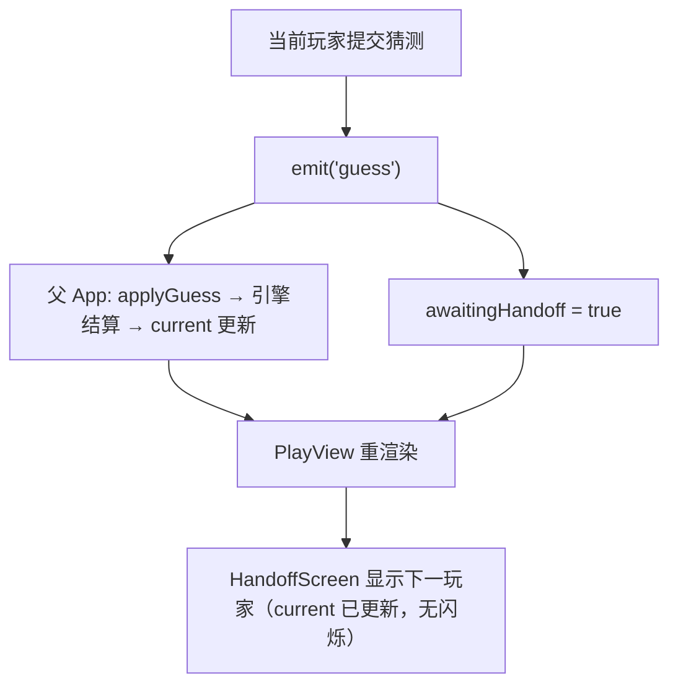

# L3 · 保密与交接（Handoff）

> 上层：[L2 UI 层](../L2-components/ui.md) ｜ 相关组件：`HandoffScreen.vue` `SetupView.vue` `PlayView.vue`

热座模式两人共用一台电脑，**交接屏**既是仪式感也是**防窥**手段：在每次该换人操作前插入一块过渡屏，保证上一个人输入/查看的内容不会被下一个人看到。**交接屏完全是 UI 层本地状态，引擎状态机不感知。**

## setup 阶段：P1 → 交接 → P2

`SetupView.vue` 用一个本地 `step` ref 编排三步：`'p1' → 'handoff' → 'p2'`。

```mermaid
sequenceDiagram
    participant U1 as 玩家1
    participant SV as SetupView(step)
    participant SI as SecretInput
    participant H as HandoffScreen
    participant U2 as 玩家2
    U1->>SI: 输入秘密数（可隐藏为 ●）
    SI->>SV: emit confirm(value)
    SV->>SV: emit setSecret('p1', value); step='handoff'
    SV->>H: 显示「请把电脑交给玩家2」
    U2->>H: 点击「开始」
    H->>SV: emit continue → step='p2'
    SV->>SI: 新的 SecretInput（label=玩家2）
    U2->>SI: 输入秘密数
    SI->>SV: emit confirm(value)
    SV->>SV: emit setSecret('p2', value)
```

对应代码（`SetupView.vue`）：

```typescript
type Step = 'p1' | 'handoff' | 'p2'
const step = ref<Step>('p1')

function confirmP1(value: string) {
  emit('setSecret', 'p1', value)
  step.value = 'handoff'        // P1 确认后立刻切交接屏，清掉 P1 的输入画面
}
function confirmP2(value: string) {
  emit('setSecret', 'p2', value)   // 引擎在此转入 playing
}
```

`SecretInput` 确认后会把自己的 `value` 清空（`value.value = ''`），叠加交接屏，P2 不会看到 P1 输入的痕迹。

## playing 阶段：每次猜测后插交接屏，无闪烁

`PlayView.vue` 用本地 `awaitingHandoff` ref。**初始即为 `true`**——进入猜测阶段先看到交接屏；每次猜测后再次置 `true`。

```typescript
const awaitingHandoff = ref(true)
const playerName  = computed(() => (props.current === 'p1' ? '玩家1' : '玩家2'))
const currentHistory = computed(() => props.history[props.current])

function onGuess(value: string) {
  emit('guess', value)           // ① 先通知父组件
  awaitingHandoff.value = true    // ② 再立刻回到交接屏
}
```

**无闪烁的关键顺序**：

```
P2 在 PlayView 提交猜测
   │ onGuess: emit('guess') —— 父(App) 调 applyGuess → 引擎结算 → current 变为 p1
   │ onGuess: awaitingHandoff = true
   ▼
父组件先同步更新 props.current（已是 p1），PlayView 再渲染交接屏
   → playerName 此时已经是「玩家1」
   → 交接屏直接显示「请把电脑交给【玩家1】」，不会先闪一下「玩家2」再跳变
```

因为 Vue 在同一次更新里先应用父组件传下来的新 `current`，`awaitingHandoff` 切回 `true` 时 `playerName` 已经是下一玩家，交接屏一出现就是正确的下一玩家名，**无闪烁**。



## 当前玩家只看自己历史，结束才公开双方

防窥的第二层：**playing 阶段，当前玩家只能看到自己对对方数字的猜测历史**，看不到对方的历史与秘密。

```typescript
// PlayView.vue
const currentHistory = computed(() => props.history[props.current])  // 只取当前玩家
// 模板：<HistoryList :records="currentHistory" :title="`【${playerName}】的猜测记录`" />
```

游戏结束后，`ResultView.vue` 才**公开双方的秘密与完整历史**：

```vue
<p class="reveal">玩家1 的数字：{{ secrets.p1 }}　玩家2 的数字：{{ secrets.p2 }}</p>
<HistoryList :records="history.p1" title="玩家1 的猜测" />
<HistoryList :records="history.p2" title="玩家2 的猜测" />
```

| 阶段 | 看得到什么 |
|------|-----------|
| setup | 各自输入自己的秘密数（可隐藏 ●），交接屏隔开 |
| playing | 当前玩家只看**自己**的猜测历史；对方秘密/历史均不显示 |
| over | ResultView 公开**双方**秘密与完整历史 |

> 引擎层存的是明文 `secret`（单机热座不加密），保密完全靠 UI **永不渲染对方 secret**、结束才公开。联网版才需要服务端保管 secret（扩展点）。
