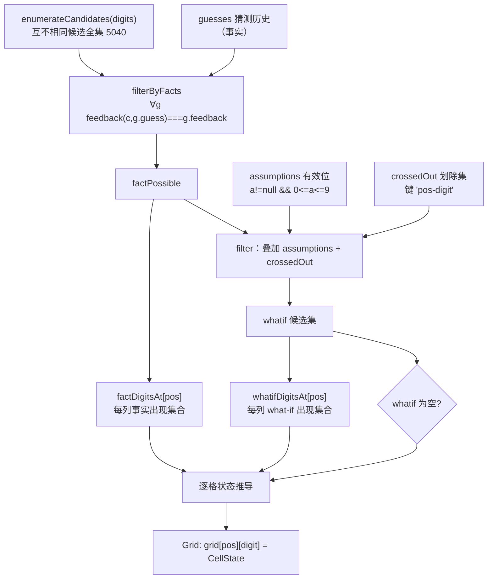

# L3 · 推理引擎细节（Solver）

> 上层：[L1 概览](../L1-overview.md) · [L2 UI 层](../L2-components/ui.md) ｜ 下钻：[L4 solver API](../L4-api/solver.md) ｜ 源码：`src/game/solver.ts` · `src/components/SolverPanel.vue`
>
> 关联设计：[solver-panel-design spec](../superpowers/specs/2026-06-22-solver-panel-design.md)

## 这是什么

猜测阶段，左右两侧各有一个**推理提示助手**（红方 / 蓝方）。每个助手是 **4 列 × 10 格**网格（4 个数字位、每列纵向 0-9），基于该方的猜测历史**自动推理对方的秘密数字**，并支持用户「假设 / 划除」做 what-if 推演与矛盾检测。

核心由纯函数模块 `solver.ts` 承担，与对局引擎（engine/useGame）**完全独立**，只复用 `engine.feedback`。函数签名见 [L4 solver API](../L4-api/solver.md)。

## 推理原理：枚举即真值

不写复杂约束推理，而是**穷举**：

1. **候选全集**：枚举全部「N 位、每位互不相同」的秘密数。N=4 → **5040** 个（10·9·8·7）。
2. **事实过滤**：用该方的「猜测 + 正确数目」历史筛掉不可能的候选——只保留对每条记录都满足 `feedback(候选, 猜测) === 正确数目` 的候选，得 `factPossible`。
3. **what-if 叠加**：再叠加用户的「假设 / 划除」作为额外约束，得 `whatif` 候选集。
4. **逐格定状态**：每个 `grid[pos][digit]` 的状态从 `factPossible` / `whatif` 在该列出现过的数字集合推导。

> **枚举即真值**——联动收窄与矛盾检测都自然从候选集得出，正确性可证明。N=4 数据量极小（5040 × 历史条数），毫秒级。

```text
互不相同候选全集(N=4, 5040)
        │  事实过滤：∀g feedback(c, g.guess)===g.feedback
        ▼
   factPossible ───────────────────────────┐
        │  叠加 assumptions（有效 0-9 位）   │
        │  叠加 crossedOut（"pos-digit"）    │
        ▼                                    │
     whatif ──▶ 逐列出现集合 ──▶ 每格五状态  │
                                             │
   （factPossible 仅用于判断「事实是否还有此数字」）
```

## 流程图



## 五状态推导表

`solve` 对每个格子 `(pos, digit)`，自上而下短路判定（与 `solver.ts` 实现一致）。先定义：

- `posDigitOK` = `whatif` 中第 `pos` 位出现过该数字
- `factHasIt` = `factPossible` 中第 `pos` 位出现过该数字
- `colOnlyThis` = `whatif` 第 `pos` 位出现过的数字集合恰为 `{ 该数字 }`
- `whatifEmpty` = `whatif` 为空

| 优先级 | 触发条件 | 结果状态 | 含义 |
|:---:|------|------|------|
| 1 | `assumptions[pos] === digit` 且 `posDigitOK && !whatifEmpty` | `assumed` | 用户假设且成立（高亮） |
| 1 | `assumptions[pos] === digit` 但 `!posDigitOK` 或 `whatifEmpty` | `conflict` | 假设但 what-if 无此值 / what-if 空（标红） |
| 2 | 该格被划除（`crossedOut` 含 `"pos-digit"`） | `eliminated` | 手动划除（灰） |
| 3 | `!factHasIt` | `eliminated` | 事实排除：历史已否定（灰） |
| 4 | `colOnlyThis` | `fixed` | 该列只剩这一个（自动确定，绿） |
| 5 | `!posDigitOK` | `eliminated` | 被其它假设/划除联动排除（灰） |
| 6 | 其余 | `available` | 仍可能（默认） |

```text
// 简化自源码 solve()
if (assumptions[pos] === digit) {
  state = posDigitOK && !whatifEmpty ? 'assumed' : 'conflict'
} else if (crossedOut.has(`${pos}-${digit}`)) {
  state = 'eliminated'
} else if (!factHasIt) {
  state = 'eliminated'
} else if (colOnlyThis) {
  state = 'fixed'
} else if (!posDigitOK) {
  state = 'eliminated'
} else {
  state = 'available'
}
```

> **关键**：「是否为本列假设值」最优先，被假设的格永远是 `assumed`/`conflict`，不会被误判成 `fixed`/`eliminated`。

## 联动收窄与矛盾检测

二者都不是手写规则，而是 `whatif` 候选集的**自然推论**：

- **联动收窄**：一旦在某列假设了一个值（或划除若干），`whatif` 立即缩小，其它列的 `whatifDigitsAt[pos]` 随之变化——原本 `available` 的格可能因不再出现于任何 `whatif` 候选而变 `eliminated`，或某列收窄到唯一值而变 `fixed`。
- **矛盾检测**：若假设组合在事实下无解，`whatif` 为空（`whatifEmpty`），所有被假设的格落入 `conflict` 分支标红；单个假设值若不出现在任何 `whatif` 候选中（即使 whatif 非空），该假设格同样 `conflict`。

## 带数字的推导示例

### 示例 1 · 事实排除（整列置灰）

猜 `0000`，得到「正确数目 0」⇒ 对方秘密数**任何位置都不是 0**。事实过滤后 `factPossible` 里每个候选的每一位都不为 `0`，于是每列的数字 `0` 都 `!factHasIt` → `eliminated`（灰）。

```text
位1  位2  位3  位4
[0]灰 [0]灰 [0]灰 [0]灰   ← 正确数目 0 → 全列 0 被事实排除
[1]   [1]   [1]   [1]
...
```

### 示例 2 · 假设联动（其它列同值置灰）

在 `位1` 假设 `5`（`assumptions[0]=5`）。因为秘密数**互不相同**，候选里出现 `5` 的位置只能是第 0 位，所以 `whatif` 中其它列都不会再出现 `5`：

```text
位1      位2     位3     位4
[5]假设  [5]灰   [5]灰   [5]灰    ← 位1 假设 5 → 其它列 5 联动排除
```

`位1` 的 `5` 显示 `assumed`（高亮，且若该列已收窄到唯一也仍判 assumed）。

### 示例 3 · 矛盾（两位假设同值）

在 `位1` 假设 `5`，又在 `位2` 假设 `5`。任何互不相同候选都不可能两位同为 `5` ⇒ `whatif` 为空。`whatifEmpty` 为真，两个被假设的格都走 `conflict` 分支：

```text
位1      位2
[5]红    [5]红   ← what-if 无解，两处假设均标红
```

## 健壮性

- **稀疏/越界假设当作无假设**：过滤条件为 `a != null && a >= 0 && a <= 9`，`null`/`undefined`/越界值都被跳过，不会误清空 `whatif`（避免「整盘标红」的退化）。
- **猜测可重复**：猜测允许重复数字（如 `0000`），候选互不相同；`feedback('0123','0000')` 这类照常计算，事实过滤不受影响。
- **纯函数**：相同 `SolverInput` 恒得相同 `Grid`，可穷尽单测。

## 面板侧（`SolverPanel.vue`）

- props：`digits` / `guesses` / `side`（`'red' | 'blue'`），**无对外 emits**。
- 本地状态：`expanded`（默认 `false` 收起）、`showHelp`、`smartMode`（默认 `true` 智能）、`assumptions`、`crossedOut`，`grid` 为 `computed`，随 `guesses`/本地状态与 `smartMode` 自动重算（智能走 `solve`、基础走 `basicSolve`）。
- 交互：**左键** = 假设（再点同格取消，点同列别格替换）；**Shift+左键 / 右键 / Delete** = 划除；**重置假设**清空本面板 assumptions+crossedOut；**折叠条**点击展开/收起。
- App 接线：红方面板传 `state.history.p1`、蓝方传 `state.history.p2`，仅 `playing` 阶段渲染。props/交互详见 [L4 components API](../L4-api/components.md)。

## 基础模式（basicSolve）

助手面板可关闭「智能推理」开关切到基础模式（`basicSolve`）。**只推排除、绝不自动判确定**：

- **规则①（反馈=0 排除）**：任一猜测 `feedback === 0` → 该猜测每位数字在对应位置标排除。
- **规则②（已知正确的行列排除）**：用户左键假设某格 (p,d) 为正确 → 该数字所在**行**的其它位置、该位置所在**列**的其它数字 全部排除（各位互不相同、每位一个数）。
- **不产生 `fixed`**：某列即使只剩一个可能也不自动判「确定(绿)」。
- **矛盾**：假设格落入排除集即 `conflict`（如两个位置假设同一数字、或假设一个反馈=0 已排除的格）。
- **优先级假设最先**：与智能模式 `solve` 一致——被假设的格只会是 `assumed`/`conflict`，右键划除不会掩盖矛盾。
- 右键划除在基础模式下仅作手动标记，不参与推理。

与智能 `solve`（全枚举 + 事实过滤 + 假设/划除联动 + 自动 fixed）的差异见设计文档
`docs/superpowers/specs/2026-06-23-solver-basic-mode-design.md`。开关每面板独立、默认开启智能、不持久化（刷新回默认）。
