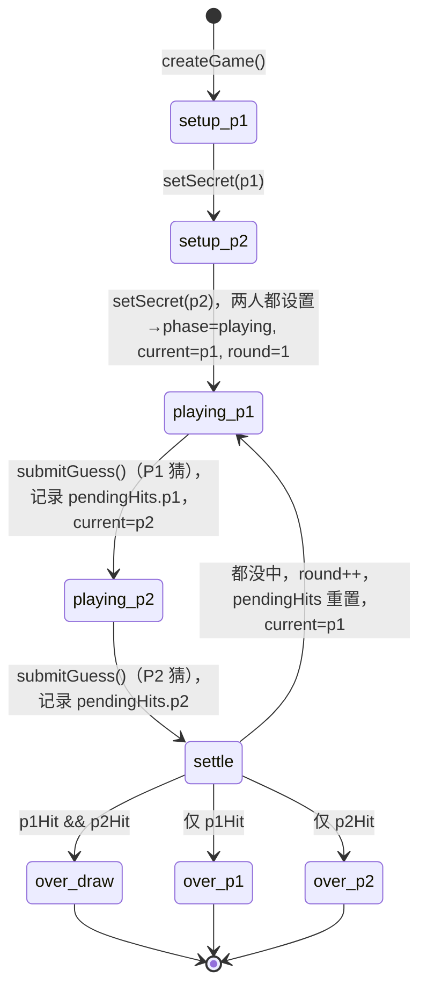

# L3 · 状态机与回合结算（`engine.ts`）

> 上层：[L2 引擎层](../L2-components/engine.md) ｜ 下钻：[L4 engine API](../L4-api/engine.md)

## 完整状态机图

阶段 `phase`：`setup` → `playing` → `over`。`setup` 内部还有「等 P1 / 等 P2」两个子态（由 `secrets` 是否为 `null` 区分）。



ASCII 版：

```
[setup 等P1] --setSecret(p1)--> [setup 等P2] --setSecret(p2)--> [playing P1 回合]

[playing P1 回合] --submitGuess--> 记 pendingHits.p1, current=p2 --> [playing P2 回合]
[playing P2 回合] --submitGuess--> 记 pendingHits.p2 --> 回合末结算：
        p1Hit && p2Hit → over: 平局
        仅 p1Hit       → over: P1 胜
        仅 p2Hit       → over: P2 胜
        都没中          → round++, pendingHits={f,f}, current=p1 → [playing P1 回合]
```

## `submitGuess` 回合末四分支结算（伪代码）

`submitGuess` 的关键在于：**P1 猜完只切换 current，不结算；P2 猜完才进入四分支结算。**

```
function submitGuess(state, value):
    assert state.phase == 'playing'                 # 否则抛错
    assert validateGuess(value).ok                  # 否则抛错

    player   = state.current
    opponent = otherPlayer(player)
    fb       = feedback(state.secrets[opponent], value)   # Bulls 数
    hit      = (fb === config.digits)               # 是否全中

    history[player]     += { guess: value, feedback: fb } # 追加（不可变）
    pendingHits[player]  = hit

    if player == 'p1':
        return { ...state, history, pendingHits, current: 'p2' }   # 同回合，轮后手

    # ── 到这里 player == 'p2'，本回合两人都猜过了，回合末结算 ──
    (p1Hit, p2Hit) = pendingHits
    if p1Hit && p2Hit:  return over(draw)                # ① 双中 → 平局
    if p1Hit:           return over(win 'p1')            # ② 仅 P1 中 → P1 胜
    if p2Hit:           return over(win 'p2')            # ③ 仅 P2 中 → P2 胜
    return {                                              # ④ 都没中 → 下一回合
        ...state, history,
        pendingHits: { p1: false, p2: false },
        round: state.round + 1,
        current: 'p1',
    }
```

对照真实代码（`engine.ts` 第 75–95 行）四分支顺序一致：`p1Hit && p2Hit` → `p1Hit` → `p2Hit` → 都没中。

## 公平性原理

> **先手猜中不立即结束，回合末统一结算，保证双方猜测次数相等。**

设先手 P1 在第 *k* 次猜测时首次猜中。若此刻就判 P1 胜，则 P2 只猜了 *k−1* 次——比 P1 少一次机会，不公平。

本引擎的做法：P1 猜中时只把 `pendingHits.p1 = true` 并把 `current` 切给 P2，**不结束**。P2 在同一回合也猜一次（第 *k* 次），然后才结算：

- 若 P2 这第 *k* 次也猜中 → `pendingHits` 双 true → **平局**。
- 若只有 P1 中 → **P1 胜**。

由此，胜负**只在「一个完整回合（P1 猜 + P2 猜）结束」时结算**，两人猜测次数恒等（都为 *k*）。

```
回合 k:  P1 第k次猜（中！但不结束） → P2 第k次猜 → 结算
          ├ P2 也中 → 平局（次数都=k）
          └ P2 没中 → P1 胜（次数都=k）
```

## `pendingHits` / `round` / `current` 的演化

| 字段 | 含义 | 演化规则 |
|------|------|----------|
| `current` | 当前轮到谁猜 | 初始 `p1`；P1 猜后→`p2`；回合末「都没中」时→`p1`。 |
| `round` | 回合数，从 1 开始 | 初始 `1`；仅在「都没中」的回合末 `round + 1`。 |
| `pendingHits` | 本回合双方是否已猜中（回合末结算用） | 每次猜测后写入对应玩家；进入下一回合时重置为 `{p1:false, p2:false}`。 |

一个三回合到分胜负的示例演化：

```
round=1  current=p1  pendingHits={f,f}
  P1 猜（没中）      → current=p2  pendingHits={f,f}
  P2 猜（没中）      → 结算④       round=2 current=p1 pendingHits={f,f}
round=2  current=p1
  P1 猜（中！）      → current=p2  pendingHits={t,f}   ← 不结束
  P2 猜（没中）      → 结算② P1 胜  phase=over outcome=win('p1')
```

> 注意：`pendingHits` 在「P1 中、P2 没中」结算时不必显式重置（已进入 `over`，状态机停止）；只有「都没中」分支会显式重置以开启干净的下一回合。
