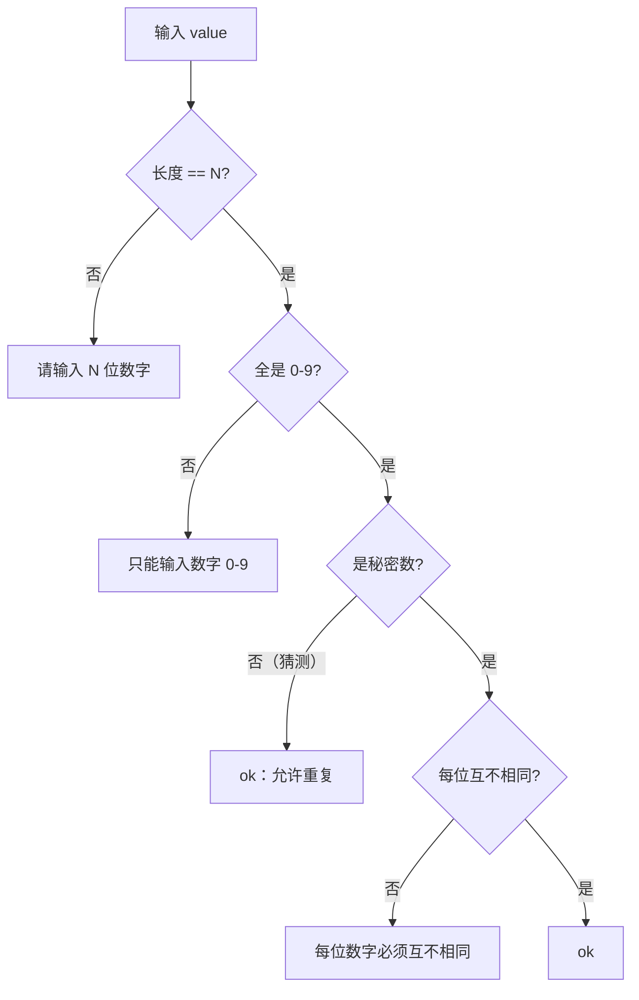

# L3 · 输入校验（`validate.ts` + 引擎断言）

> 上层：[L2 引擎层](../L2-components/engine.md) ｜ 下钻：[L4 validate API](../L4-api/validate.md)

校验分两层：**用户可见校验**（`validateSecret` / `validateGuess`，返回 `ValidationResult`，不抛错，文案用于 UI 实时红字提示）与**引擎防御性断言**（非法调用直接抛 `Error`，保护编程错误）。

## 校验规则表

两者都先走私有 `checkShape`（长度 → 字符），秘密数再额外校验唯一性；猜测**允许重复**。

| 检查项 | 顺序 | 秘密数 `validateSecret` | 猜测 `validateGuess` | 错误文案 |
|--------|------|------------------------|---------------------|----------|
| 长度 = N | ① | ✅ 校验 | ✅ 校验 | `请输入 ${digits} 位数字` |
| 仅 0-9 字符 | ② | ✅ 校验 | ✅ 校验 | `只能输入数字 0-9` |
| 每位互不相同 | ③ | ✅ 校验 | ❌ **允许重复** | `每位数字必须互不相同` |



对应代码：

```typescript
function checkShape(value: string, digits: number): ValidationResult | null {
  if (value.length !== digits) return { ok: false, error: `请输入 ${digits} 位数字` }
  if (!/^[0-9]+$/.test(value))  return { ok: false, error: '只能输入数字 0-9' }
  return null    // 形状 OK
}

export function validateSecret(value: string, config: GameConfig): ValidationResult {
  const shape = checkShape(value, config.digits)
  if (shape) return shape
  if (new Set(value).size !== value.length)            // 唯一性：用 Set 去重比长度
    return { ok: false, error: '每位数字必须互不相同' }
  return { ok: true }
}

export function validateGuess(value: string, config: GameConfig): ValidationResult {
  const shape = checkShape(value, config.digits)
  if (shape) return shape
  return { ok: true }    // 猜测不校验唯一性
}
```

## 前导 0 用字符串保留

校验与存储**全程字符串，绝不 `parseInt`**：

- 长度判断用 `value.length`（`'0891'.length === 4`，若转数字会变 `891`，长度错）。
- 字符判断用正则 `/^[0-9]+$/`。
- 唯一性用 `new Set(value)`（按字符去重）。

因此 `0891`、`0011` 等带前导 0 的输入都能正确处理。`feedback` 比较也用 `secret[i] === guess[i]` 逐字符比较，不涉及数值。

## 引擎防御性断言（抛错）

`validate*` 面向**用户**（返回结果、UI 提示）；引擎的断言面向**编程错误**（抛 `Error`，不应在正常流程出现，因为 UI 会先用 `validate*` 把关并禁用按钮）。

| 函数 | 非法情形 | 抛出文案 |
|------|----------|----------|
| `createGame` | `digits` 非 1..10 整数 | `digits 必须是 1 到 10 之间的整数` |
| `setSecret` | `phase !== 'setup'` | `只能在 setup 阶段设置秘密数` |
| `setSecret` | 该玩家 `secrets[player] !== null`（重复设置） | `${player} 的秘密数已设置` |
| `setSecret` | `validateSecret` 不通过 | `非法秘密数：${error}` |
| `submitGuess` | `phase !== 'playing'` | `只能在 playing 阶段猜测` |
| `submitGuess` | `validateGuess` 不通过 | `非法猜测：${error}` |

> `digits` 范围 1..10 的语义原因：秘密数要求每位互不相同，0-9 最多 10 个不同数字，故 N 上限为 10。

## UI 如何使用校验

- `SecretInput` / `GuessInput` 用 `computed(() => props.validate(value.value))` 实时求值。
- `ok` 为 false 时按钮 `:disabled`，并在下方 `role="alert"` 红字显示 `error`。
- `useGame` 暴露 `checkSecret` / `checkGuess` 作为 `validate` prop 传入（已绑定当前 `config`）。
- 输入框 `@input` 还会过滤非数字、按 `maxlength` 截断（详见 [L2 UI 层 · 输入约定](../L2-components/ui.md)），引擎层再做**二次校验**（不信任 UI）。
