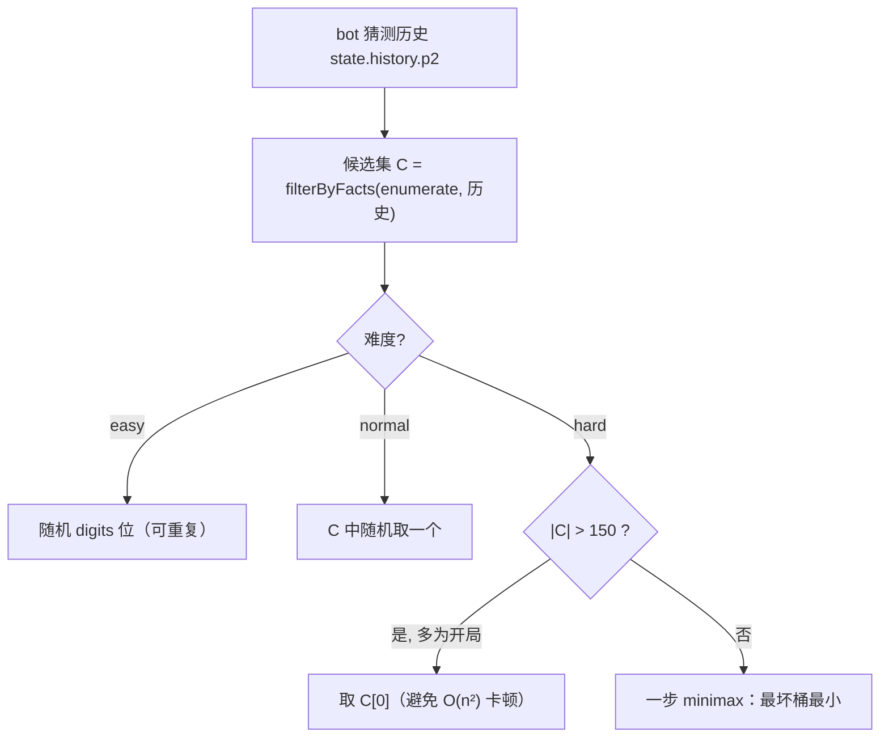
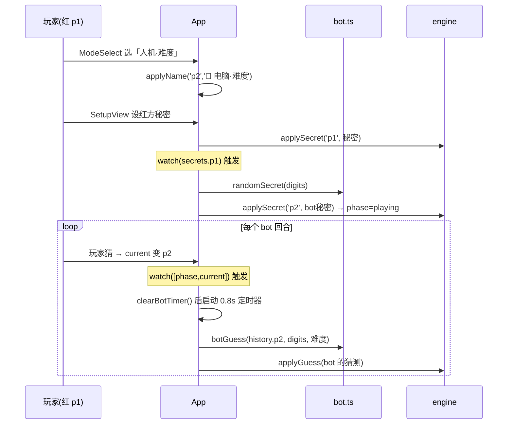

# 人机对战（Bot Opponent）Implementation Plan

> **For agentic workers:** REQUIRED SUB-SKILL: Use superpowers:subagent-driven-development (recommended) or superpowers:executing-plans to implement this plan task-by-task. Steps use checkbox (`- [ ]`) syntax for tracking.

**Goal:** 在开局新增「双人(热座) / 人机对战」选择；人机模式下玩家先手对战一个复用现有 solver 的 AI（简单/普通/困难三档），引擎保持纯净不改。

**Architecture:** 新增纯函数模块 `src/game/bot.ts`（随机秘密 + 三档选猜，复用 `solver.ts` 的候选枚举/过滤与 `engine.ts` 的 `feedback`）。新增 `ModeSelect.vue` 组件。`App.vue` 用 `gameMode` 状态切换 ModeSelect/既有流程，并用两个 `watch` 驱动 bot：玩家设秘密后自动给 bot 设随机秘密；轮到 bot 时延迟 ~0.8s 自动出招（带「电脑思考中」提示，统一 `clearBotTimer` 防重入/串台）。bot 名内嵌 🤖（`🤖 电脑·难度`），经既有 `sideName` 在对局/结果/历史自动显示，渲染组件零改动。

**Tech Stack:** Vue 3 `<script setup>` + TypeScript + Vite + Vitest + @vue/test-utils。

**Spec:** `docs/superpowers/specs/2026-06-23-bot-opponent-design.md`

---

## 文件结构

**新增：**
- `src/game/bot.ts` — 纯逻辑：`BotDifficulty` 类型、`randomSecret(digits, rnd?)`、`botGuess(guesses, digits, difficulty, rnd?)`。唯一职责：在无副作用前提下产出 bot 的秘密与每步猜测。依赖 `solver.ts`（候选）+ `engine.ts`（feedback）+ `types.ts`。
- `src/game/bot.test.ts` — bot 单测（注入确定性 `rnd`）。
- `src/components/ModeSelect.vue` — 开局模式/难度选择，`emit('select', mode, difficulty?)`。唯一职责：收集模式选择，不持有游戏状态。
- `src/components/ModeSelect.test.ts` — ModeSelect 组件测试。

**修改：**
- `src/game/types.ts` — 新增 `export type GameMode = 'pvp' | 'pve'`。
- `src/components/SetupView.vue` — 新增 `vsBot?: boolean` prop（pve 只走玩家一步、`confirmP1` 不进 handoff）。
- `src/components/PlayView.vue` — 新增 `botTurn?: boolean` prop（隐藏玩家输入、显示「电脑思考中」）。
- `src/App.vue` — `gameMode`/`botDifficulty`/`botName` 状态、ModeSelect 渲染与 `onSelectMode`、watch 自动设 bot 秘密、watch 自动出招 + `botThinking` + `clearBotTimer`、`playAgain` 回 ModeSelect、向 SetupView/PlayView 透传新 prop。
- `src/App.test.ts` — 现有集成测试加 `selectPvp` 中转；更新两处再战断言（回 ModeSelect）。
- `src/App.recording.test.ts` / `src/App.history-integration.test.ts` — `playToWin` / 昵称用例加 `selectPvp` 中转。
- `src/style.css` — `.mode-select` / `.bot-thinking` 样式。
- 文档 `docs/L2-*.md`/`docs/L3-*.md`/`docs/L4-*.md` + `README.md`（按既有分层补 bot）。

**零改动（经既有 `sideName(_, names)` 自动显示带 🤖 的 bot 名）：** `HistoryView.vue` / `HistoryList.vue` / `ResultView.vue` / 历史 schema。

---

## Task 1: `bot.ts` — `randomSecret`（随机互异秘密）

**Files:**
- Create: `src/game/bot.ts`
- Test: `src/game/bot.test.ts`

- [ ] **Step 1: 写失败测试**

Create `src/game/bot.test.ts`:

```typescript
import { describe, it, expect } from 'vitest'
import { randomSecret } from './bot'

// 返回固定序列的确定性 rnd（循环复用）
function seq(values: number[]): () => number {
  let i = 0
  return () => values[i++ % values.length]
}

describe('randomSecret', () => {
  it('长度=digits、每位 0-9、互不相同', () => {
    for (let t = 0; t < 50; t++) {
      const s = randomSecret(4)
      expect(s).toHaveLength(4)
      expect(new Set(s).size).toBe(4)
      expect(/^[0-9]{4}$/.test(s)).toBe(true)
    }
  })

  it('digits=10 时是 0-9 的一个排列', () => {
    const s = randomSecret(10)
    expect(s).toHaveLength(10)
    expect([...s].sort().join('')).toBe('0123456789')
  })

  it('确定性：相同 rnd 序列 → 相同输出', () => {
    const r = [0.1, 0.2, 0.3, 0.4, 0.5, 0.6, 0.7, 0.8, 0.9]
    expect(randomSecret(4, seq(r))).toBe(randomSecret(4, seq(r)))
  })
})
```

- [ ] **Step 2: 跑测试确认失败**

Run: `npx vitest run src/game/bot.test.ts`
Expected: FAIL — 无法解析 `./bot`（模块不存在）。

- [ ] **Step 3: 写最小实现**

Create `src/game/bot.ts`:

```typescript
export type BotDifficulty = 'easy' | 'normal' | 'hard'

// 随机互不相同的 digits 位秘密：Fisher–Yates 洗牌 0-9，取前 digits 位。digits 必须 ≤ 10。
export function randomSecret(digits: number, rnd: () => number = Math.random): string {
  const ds = ['0', '1', '2', '3', '4', '5', '6', '7', '8', '9']
  for (let i = ds.length - 1; i > 0; i--) {
    const j = Math.floor(rnd() * (i + 1))
    ;[ds[i], ds[j]] = [ds[j], ds[i]]
  }
  return ds.slice(0, digits).join('')
}
```

（`randomSecret` 不依赖 solver/engine；`botGuess` 及其 import、`HARD_MINIMAX_THRESHOLD` 在 Task 2/3 渐进加入，保持每步无未使用符号。）

- [ ] **Step 4: 跑测试确认通过**

Run: `npx vitest run src/game/bot.test.ts`
Expected: PASS（3 个用例）。

- [ ] **Step 5: 提交**

```bash
git add src/game/bot.ts src/game/bot.test.ts
git commit -m "feat(bot): randomSecret 生成随机互异秘密

Co-authored-by: Copilot <223556219+Copilot@users.noreply.github.com>"
```

---

## Task 2: `bot.ts` — `botGuess` 简单 / 普通档

**Files:**
- Modify: `src/game/bot.ts`
- Test: `src/game/bot.test.ts`

- [ ] **Step 1: 追加失败测试**

Append to `src/game/bot.test.ts`（在文件末尾、`describe('randomSecret'...)` 之后新增）:

```typescript
import { botGuess } from './bot'
import { enumerateCandidates, filterByFacts } from './solver'

describe('botGuess 简单档', () => {
  it('easy：digits 位、字符合法（允许重复），忽略候选', () => {
    const g = botGuess([], 4, 'easy', seq([0.05, 0.15, 0.25, 0.35]))
    expect(g).toBe('0123') // floor([0.05,0.15,0.25,0.35]*10) = 0,1,2,3
    expect(/^[0-9]{4}$/.test(g)).toBe(true)
  })

  it('easy：确定性，相同 rnd → 相同输出', () => {
    const r = [0.1, 0.2, 0.3, 0.4]
    expect(botGuess([], 4, 'easy', seq(r))).toBe(botGuess([], 4, 'easy', seq(r)))
  })
})

describe('botGuess 普通档', () => {
  it('normal：从候选集中选（rnd=0 取候选首个）', () => {
    const guesses = [{ guess: '0123', feedback: 1 }]
    const cands = filterByFacts(enumerateCandidates(4), guesses)
    const g = botGuess(guesses, 4, 'normal', () => 0)
    expect(g).toBe(cands[0])
    expect(cands).toContain(g)
  })

  it('normal：所选猜测一定与历史反馈自洽（属于候选集）', () => {
    const guesses = [{ guess: '0123', feedback: 0 }] // 0,1,2,3 不在各自位置
    const cands = filterByFacts(enumerateCandidates(4), guesses)
    const g = botGuess(guesses, 4, 'normal', () => 0.999)
    expect(cands).toContain(g)
  })

  it('normal：候选为空（历史自相矛盾）时回退合法随机猜', () => {
    const guesses = [
      { guess: '0123', feedback: 4 }, // 秘密必为 0123
      { guess: '0123', feedback: 0 }, // 又说全不对 → 矛盾，候选空
    ]
    const g = botGuess(guesses, 4, 'normal', seq([0, 0, 0, 0]))
    expect(g).toHaveLength(4)
    expect(/^[0-9]{4}$/.test(g)).toBe(true)
  })
})
```

- [ ] **Step 2: 跑测试确认失败**

Run: `npx vitest run src/game/bot.test.ts`
Expected: FAIL — `botGuess` 未导出。

- [ ] **Step 3: 写最小实现**

先在 `src/game/bot.ts` 顶部 import 区加入：

```typescript
import type { GuessRecord } from './types'
import { enumerateCandidates, filterByFacts } from './solver'
```

再在文件末尾 append：

```typescript
function randomGuess(digits: number, rnd: () => number): string {
  let s = ''
  for (let i = 0; i < digits; i++) s += Math.floor(rnd() * 10)
  return s
}

// bot(p2) 依据其对玩家秘密的猜测历史 guesses(=state.history.p2) 选下一猜。
export function botGuess(
  guesses: GuessRecord[],
  digits: number,
  difficulty: BotDifficulty,
  rnd: () => number = Math.random,
): string {
  if (difficulty === 'easy') return randomGuess(digits, rnd)

  const candidates = filterByFacts(enumerateCandidates(digits), guesses)
  if (candidates.length === 0) return randomGuess(digits, rnd)

  // normal：从候选随机；hard 在 Task 3 实现，暂同 normal 占位（下一个任务替换）
  return candidates[Math.floor(rnd() * candidates.length)]
}
```

- [ ] **Step 4: 跑测试确认通过**

Run: `npx vitest run src/game/bot.test.ts`
Expected: PASS（randomSecret 3 + easy 2 + normal 3 = 8）。

- [ ] **Step 5: 提交**

```bash
git add src/game/bot.ts src/game/bot.test.ts
git commit -m "feat(bot): botGuess 简单(随机)/普通(候选随机)档

Co-authored-by: Copilot <223556219+Copilot@users.noreply.github.com>"
```

---

## Task 3: `bot.ts` — `botGuess` 困难档（一步 minimax）

**Files:**
- Modify: `src/game/bot.ts`
- Test: `src/game/bot.test.ts`

- [ ] **Step 1: 追加失败测试**

Append to `src/game/bot.test.ts`（文件末尾新增；`feedback` 从 `./engine` 导入）:

```typescript
import { feedback } from './engine'

describe('botGuess 困难档', () => {
  // 给定候选集 C，返回猜 x 时的最坏剩余桶大小
  function worstBucket(C: string[], x: string): number {
    const m = new Map<number, number>()
    let w = 0
    for (const s of C) {
      const f = feedback(s, x)
      const n = (m.get(f) ?? 0) + 1
      m.set(f, n)
      if (n > w) w = n
    }
    return w
  }

  it('hard：返回候选集中「最坏剩余最小」的猜测', () => {
    const guesses = [{ guess: '0123', feedback: 3 }]
    const C = filterByFacts(enumerateCandidates(4), guesses)
    expect(C.length).toBeLessThanOrEqual(150) // 走 minimax 分支（feedback:3 → 24 候选；feedback:1 会是 1424 个 >150）
    const g = botGuess(guesses, 4, 'hard')
    expect(C).toContain(g) // 只从候选选（既最优又可能直接命中）
    const gw = worstBucket(C, g)
    for (const c of C) expect(gw).toBeLessThanOrEqual(worstBucket(C, c))
  })

  it('hard：平局取候选序最前者（确定性）', () => {
    const guesses = [{ guess: '0123', feedback: 3 }]
    expect(botGuess(guesses, 4, 'hard')).toBe(botGuess(guesses, 4, 'hard'))
  })

  it('hard：候选过多(>150，如开局)时取候选首个，避免卡顿', () => {
    const g = botGuess([], 4, 'hard') // 空历史 → C = 全部 5040
    expect(g).toBe(enumerateCandidates(4)[0]) // '0123'
  })

  it('hard：候选为空时回退合法随机猜', () => {
    const guesses = [
      { guess: '0123', feedback: 4 },
      { guess: '4567', feedback: 4 },
    ] // 互斥 → 候选空
    const g = botGuess(guesses, 4, 'hard', seq([0, 0, 0, 0]))
    expect(g).toHaveLength(4)
  })
})
```

- [ ] **Step 2: 跑测试确认失败**

Run: `npx vitest run src/game/bot.test.ts`
Expected: FAIL — hard 当前走 normal 占位（随机），不满足「最坏剩余最小」断言。

- [ ] **Step 3: 写实现（替换占位，加入 minimax）**

先在 `src/game/bot.ts` 顶部 import 区加入 `feedback`：

```typescript
import { feedback } from './engine'
```

并在 `randomGuess` 之前加入阈值常量：

```typescript
// 困难档一步 minimax 的候选规模上限：超过则取候选首个，避免开局 O(n^2) 卡顿
const HARD_MINIMAX_THRESHOLD = 150
```

然后把 `botGuess` 末尾的 normal 占位逻辑替换为分档逻辑，并新增 `minimaxGuess`：

```typescript
// 将 botGuess 的最后一行（占位 return）替换为：
  if (difficulty === 'normal') {
    return candidates[Math.floor(rnd() * candidates.length)]
  }

  // hard
  if (candidates.length > HARD_MINIMAX_THRESHOLD) return candidates[0]
  return minimaxGuess(candidates)
}

// 一步 minimax：对每个候选 g，按 feedback(s,g) 把候选集分桶，取最大桶（猜 g 后最坏剩余）；
// 选使「最大桶最小」的 g。严格小于比较 → 平局保留候选序最前者（确定性）。
function minimaxGuess(candidates: string[]): string {
  let best = candidates[0]
  let bestWorst = Infinity
  for (const g of candidates) {
    const buckets = new Map<number, number>()
    let worst = 0
    for (const s of candidates) {
      const fb = feedback(s, g)
      const n = (buckets.get(fb) ?? 0) + 1
      buckets.set(fb, n)
      if (n > worst) worst = n
    }
    if (worst < bestWorst) {
      bestWorst = worst
      best = g
    }
  }
  return best
}
```

注意：`botGuess` 内原 `return candidates[Math.floor(rnd() * candidates.length)]` 这一行被上面的分档逻辑替换；`feedback` 与 `HARD_MINIMAX_THRESHOLD` 已在本步加入。

- [ ] **Step 4: 跑测试确认通过**

Run: `npx vitest run src/game/bot.test.ts`
Expected: PASS（共 12 个用例）。

- [ ] **Step 5: 类型检查 + 提交**

Run: `npx vue-tsc --noEmit`
Expected: 无错误。

```bash
git add src/game/bot.ts src/game/bot.test.ts
git commit -m "feat(bot): botGuess 困难档一步 minimax（最坏剩余最小，阈值150保护）

Co-authored-by: Copilot <223556219+Copilot@users.noreply.github.com>"
```

---

## Task 4: `types.ts` 新增 `GameMode` + `ModeSelect.vue` 组件

**Files:**
- Modify: `src/game/types.ts`
- Create: `src/components/ModeSelect.vue`
- Test: `src/components/ModeSelect.test.ts`

- [ ] **Step 1: 加 `GameMode` 类型**

In `src/game/types.ts`, 在 `export type Phase = ...` 一行下方新增：

```typescript
export type GameMode = 'pvp' | 'pve'
```

- [ ] **Step 2: 写失败测试**

Create `src/components/ModeSelect.test.ts`:

```typescript
import { describe, it, expect } from 'vitest'
import { mount } from '@vue/test-utils'
import ModeSelect from './ModeSelect.vue'

describe('ModeSelect', () => {
  it('初始渲染双人 / 人机两个模式按钮', () => {
    const w = mount(ModeSelect)
    expect(w.find('.mode-pvp').exists()).toBe(true)
    expect(w.find('.mode-pve').exists()).toBe(true)
    expect(w.text()).toContain('双人')
    expect(w.text()).toContain('人机')
  })

  it('点「双人」立即 emit select=pvp（无难度）', async () => {
    const w = mount(ModeSelect)
    await w.find('.mode-pvp').trigger('click')
    expect(w.emitted('select')).toEqual([['pvp']])
  })

  it('点「人机」展开难度，不立即 emit', async () => {
    const w = mount(ModeSelect)
    await w.find('.mode-pve').trigger('click')
    expect(w.find('.difficulty-options').exists()).toBe(true)
    expect(w.emitted('select')).toBeUndefined()
  })

  it('选困难并开始 → emit select=pve,hard', async () => {
    const w = mount(ModeSelect)
    await w.find('.mode-pve').trigger('click')
    const hard = w.findAll('input[type="radio"]').find((r) => (r.element as HTMLInputElement).value === 'hard')!
    await hard.setValue()
    await w.find('.start-pve').trigger('click')
    expect(w.emitted('select')).toEqual([['pve', 'hard']])
  })

  it('默认难度为普通（直接开始 → emit pve,normal）', async () => {
    const w = mount(ModeSelect)
    await w.find('.mode-pve').trigger('click')
    await w.find('.start-pve').trigger('click')
    expect(w.emitted('select')).toEqual([['pve', 'normal']])
  })
})
```

- [ ] **Step 3: 跑测试确认失败**

Run: `npx vitest run src/components/ModeSelect.test.ts`
Expected: FAIL — 无法解析 `./ModeSelect.vue`。

- [ ] **Step 4: 写实现**

Create `src/components/ModeSelect.vue`:

```vue
<script setup lang="ts">
import { ref } from 'vue'
import type { GameMode } from '../game/types'
import type { BotDifficulty } from '../game/bot'

const emit = defineEmits<{ select: [mode: GameMode, difficulty?: BotDifficulty] }>()

const showDifficulty = ref(false)
const difficulty = ref<BotDifficulty>('normal')
</script>

<template>
  <div class="mode-select">
    <h2>选择对战模式</h2>

    <div v-if="!showDifficulty" class="mode-options">
      <button type="button" class="mode-btn mode-pvp" @click="emit('select', 'pvp')">
        <span class="mode-icon" aria-hidden="true">👥</span>
        <span class="mode-title">双人对战</span>
        <span class="mode-desc">同一设备热座，红蓝轮流</span>
      </button>
      <button type="button" class="mode-btn mode-pve" @click="showDifficulty = true">
        <span class="mode-icon" aria-hidden="true">🤖</span>
        <span class="mode-title">人机对战</span>
        <span class="mode-desc">你先手，挑战电脑</span>
      </button>
    </div>

    <fieldset v-else class="difficulty-options">
      <legend>选择电脑难度</legend>
      <label><input v-model="difficulty" type="radio" value="easy" /> 简单 · 随机猜</label>
      <label><input v-model="difficulty" type="radio" value="normal" /> 普通 · 按线索推理</label>
      <label><input v-model="difficulty" type="radio" value="hard" /> 困难 · 最优策略</label>
      <div class="difficulty-actions">
        <button type="button" class="back-mode" @click="showDifficulty = false">← 返回</button>
        <button type="button" class="start-pve" @click="emit('select', 'pve', difficulty)">开始对战</button>
      </div>
    </fieldset>
  </div>
</template>
```

- [ ] **Step 5: 跑测试确认通过**

Run: `npx vitest run src/components/ModeSelect.test.ts`
Expected: PASS（5 个用例）。

- [ ] **Step 6: 提交**

```bash
git add src/game/types.ts src/components/ModeSelect.vue src/components/ModeSelect.test.ts
git commit -m "feat(mode-select): GameMode 类型 + 模式/难度选择组件

Co-authored-by: Copilot <223556219+Copilot@users.noreply.github.com>"
```

---

## Task 5: `SetupView.vue` 新增 `vsBot` prop（pve 只走玩家一步）

**Files:**
- Modify: `src/components/SetupView.vue`
- Test: `src/components/SetupView.test.ts`

**背景：** pve 模式下只有玩家(红方)需要手动设秘密；bot 秘密由 App 自动设。`confirmP1` 不能切到 `handoff`，否则会在 App 自动设 bot 秘密前闪现交接屏。`vsBot` 缺省/为 false 时行为与现状完全一致（现有 SetupView 测试不受影响）。

- [ ] **Step 1: 追加失败测试**

Append to `src/components/SetupView.test.ts`（`describe('SetupView'...)` 块内末尾追加用例）:

```typescript
  it('vsBot：确认红方后不进交接屏（等待 App 自动设 bot 秘密）', async () => {
    const w = mount(SetupView, { props: { digits: 4, validate: okValidate, vsBot: true } })
    expect(w.find('legend').text()).toContain('红方')
    w.findComponent(SecretInput).vm.$emit('confirm', '1234')
    await w.vm.$nextTick()
    expect(w.findComponent(HandoffScreen).exists()).toBe(false)
    expect(w.emitted('setSecret')).toEqual([['p1', '1234']])
  })
```

- [ ] **Step 2: 跑测试确认失败**

Run: `npx vitest run src/components/SetupView.test.ts`
Expected: FAIL — 当前 `confirmP1` 总是切到 handoff，`HandoffScreen` 存在。

- [ ] **Step 3: 写实现**

In `src/components/SetupView.vue`, 给 props 增加 `vsBot?`，并让 `confirmP1` 在 vsBot 时不进 handoff：

```typescript
const props = defineProps<{
  digits: number
  validate: (value: string) => ValidationResult
  names?: { p1: string | null; p2: string | null }
  vsBot?: boolean
}>()
```

```typescript
function confirmP1(value: string) {
  emit('setName', 'p1', p1Name.value)
  emit('setSecret', 'p1', value)
  if (!props.vsBot) step.value = 'handoff'
}
```

- [ ] **Step 4: 跑测试确认通过**

Run: `npx vitest run src/components/SetupView.test.ts`
Expected: PASS（现有用例 + 新用例全过）。

- [ ] **Step 5: 提交**

```bash
git add src/components/SetupView.vue src/components/SetupView.test.ts
git commit -m "feat(setup): vsBot prop——pve 下确认红方后不进交接屏

Co-authored-by: Copilot <223556219+Copilot@users.noreply.github.com>"
```

---

## Task 6: `PlayView.vue` 新增 `botTurn` prop（隐藏输入 + 思考提示）

**Files:**
- Modify: `src/components/PlayView.vue`
- Test: `src/components/PlayView.test.ts`

**背景：** bot 回合时玩家不应能输入。`botTurn` 缺省/为 false 时行为与现状一致（现有 PlayView 测试不受影响）。

- [ ] **Step 1: 追加失败测试**

Append to `src/components/PlayView.test.ts`（`describe('PlayView'...)` 块内末尾追加）:

```typescript
  it('botTurn：隐藏玩家输入，显示「电脑思考中」', () => {
    const w = mount(PlayView, { props: { ...baseProps, current: 'p2' as const, botTurn: true } })
    expect(w.findComponent(GuessInput).exists()).toBe(false)
    expect(w.find('.bot-thinking').exists()).toBe(true)
    expect(w.find('.bot-thinking').text()).toContain('电脑思考中')
  })

  it('非 botTurn：照常显示玩家输入', () => {
    const w = mount(PlayView, { props: { ...baseProps, botTurn: false } })
    expect(w.findComponent(GuessInput).exists()).toBe(true)
    expect(w.find('.bot-thinking').exists()).toBe(false)
  })
```

- [ ] **Step 2: 跑测试确认失败**

Run: `npx vitest run src/components/PlayView.test.ts`
Expected: FAIL — 无 `.bot-thinking`，botTurn 时 GuessInput 仍渲染。

- [ ] **Step 3: 写实现**

In `src/components/PlayView.vue`, 给 props 增加 `botTurn?`，模板按其切换输入/提示：

```typescript
const props = defineProps<{
  digits: number
  current: PlayerId
  validate: (value: string) => ValidationResult
  history: { p1: GuessRecord[]; p2: GuessRecord[] }
  names?: { p1: string | null; p2: string | null }
  botTurn?: boolean
}>()
```

模板中把现有 `<GuessInput .../>` 替换为：

```vue
    <GuessInput
      v-if="!botTurn"
      :key="current"
      :digits="digits"
      :validate="validate"
      :label="`${sideName(current, names)}输入`"
      @confirm="onGuess"
    />
    <p v-else class="bot-thinking" role="status" aria-live="polite">
      <span aria-hidden="true">🤖</span> 电脑思考中…
    </p>
```

- [ ] **Step 4: 跑测试确认通过**

Run: `npx vitest run src/components/PlayView.test.ts`
Expected: PASS（现有用例 + 2 新用例）。

- [ ] **Step 5: 提交**

```bash
git add src/components/PlayView.vue src/components/PlayView.test.ts
git commit -m "feat(play): botTurn prop——bot 回合隐藏玩家输入并显示思考提示

Co-authored-by: Copilot <223556219+Copilot@users.noreply.github.com>"
```

---

## Task 7: `App.vue` 接线模式选择（pvp 路径打通 + 更新现有 App 测试）

**Files:**
- Modify: `src/App.vue`
- Modify: `src/App.test.ts`
- Modify: `src/App.recording.test.ts`
- Modify: `src/App.history-integration.test.ts`

**背景：** 引入 `gameMode`（null → 渲染 ModeSelect）后，所有 `mount(App)` 的首屏从 SetupView 变为 ModeSelect。本任务打通 pvp 全流程并修复因此受影响的现有 App 集成测试（统一加 `selectPvp` 中转）。pve 的自动设秘密/出招留待 Task 8/9。ModeSelect 渲染在 `main` 内、保留 header，故「顶层标题/历史入口」相关断言不受影响。

- [ ] **Step 1: 写新失败测试（ModeSelect 首屏 + 选双人进设置）**

In `src/App.test.ts`, 顶部 import 区加：

```typescript
import ModeSelect from './components/ModeSelect.vue'
```

在 `describe('App 整合', () => {` 内最前面新增用例：

```typescript
  it('首屏显示模式选择；选双人进入红方设置', async () => {
    const w = mount(App)
    expect(w.findComponent(ModeSelect).exists()).toBe(true)
    expect(w.findComponent(SetupView).exists()).toBe(false)
    w.findComponent(ModeSelect).vm.$emit('select', 'pvp')
    await w.vm.$nextTick()
    expect(w.findComponent(SetupView).exists()).toBe(true)
  })
```

- [ ] **Step 2: 跑测试确认失败**

Run: `npx vitest run src/App.test.ts`
Expected: 新用例 FAIL（当前 mount 直接是 SetupView、无 ModeSelect）。

- [ ] **Step 3: 改 `App.vue` 实现**

（a）`import` 与状态——把脚本顶部 import 区改为包含 ModeSelect / BotDifficulty / GameMode：

```typescript
import { computed, ref, watch } from 'vue'
import { useGame } from './composables/useGame'
import { useHistory } from './composables/useHistory'
import { buildGameRecord } from './history/record'
import { saveGame } from './history/store'
import type { GameMode, PlayerId } from './game/types'
import type { GameRecord } from './history/types'
import type { BotDifficulty } from './game/bot'
import ModeSelect from './components/ModeSelect.vue'
import SetupView from './components/SetupView.vue'
import PlayView from './components/PlayView.vue'
import ResultView from './components/ResultView.vue'
import SolverPanel from './components/SolverPanel.vue'
import HistoryView from './components/HistoryView.vue'
import HistoryDetail from './components/HistoryDetail.vue'
```

（b）在 `applyName` 定义之后新增模式/难度状态与 `onSelectMode`：

```typescript
const gameMode = ref<GameMode | null>(null)
const botDifficulty = ref<BotDifficulty>('normal')
const botName = computed(
  () => '🤖 电脑·' + ({ easy: '简单', normal: '普通', hard: '困难' } as const)[botDifficulty.value],
)

function onSelectMode(mode: GameMode, difficulty?: BotDifficulty) {
  gameMode.value = mode
  if (mode === 'pve') {
    botDifficulty.value = difficulty ?? 'normal'
    applyName('p2', botName.value)
  }
}
```

（c）`playAgain` 改为回到模式选择：

```typescript
function playAgain() {
  reset() // 重置秘密数/历史/回合/outcome；保留 names（pvp 再选双人后仍预填）
  gameMode.value = null // 回到模式选择
  saved.value = false
  saveStatus.value = 'saving'
}
```

（d）模板：在 `<header class="app-head">...</header>` 之后、`<SetupView ...>` 之前插入 ModeSelect，并把 `SetupView` 的 `v-if="phase === 'setup'"` 改为 `v-else-if`，加 `:vs-bot`：

```vue
          <ModeSelect v-if="gameMode === null" @select="onSelectMode" />

          <SetupView
            v-else-if="phase === 'setup'"
            :digits="config.digits"
            :validate="checkSecret"
            :names="names"
            :vs-bot="gameMode === 'pve'"
            @set-secret="applySecret"
            @set-name="applyName"
          />
```

（PlayView / ResultView 两个分支保持不变。）

- [ ] **Step 4: 跑测试，新用例过、旧用例红（预期）**

Run: `npx vitest run src/App.test.ts`
Expected: 新「首屏显示模式选择」PASS；多数旧 App 整合用例 FAIL（首屏变 ModeSelect 找不到 SetupView）。下一步修复。

- [ ] **Step 5: 更新 `src/App.test.ts` 受影响用例**

在 `describe('App 整合'...)` 顶部（import 之后、describe 内）加共享 helper：

```typescript
async function selectPvp(w: ReturnType<typeof mount>) {
  w.findComponent(ModeSelect).vm.$emit('select', 'pvp')
  await w.vm.$nextTick()
}
```

规则：以下 5 个用例各在 `const w = mount(App)` 之后插入一行 `await selectPvp(w)`，其余不变：
`完整一局：双方设置 → 猜测 → 红方获胜`、`playing 阶段渲染左右两个 SolverPanel`、`setup 阶段不渲染 SolverPanel`、`结束阶段不渲染 SolverPanel`、`App 透传 names 到 PlayView（对局中可用昵称）`。

把 `再来一局回到设置阶段` 整体替换为：

```typescript
  it('再来一局回到模式选择', async () => {
    const w = mount(App)
    await selectPvp(w)
    w.findComponent(SetupView).vm.$emit('setSecret', 'p1', '1234')
    w.findComponent(SetupView).vm.$emit('setSecret', 'p2', '5678')
    await w.vm.$nextTick()
    w.findComponent(PlayView).vm.$emit('guess', '5678')
    await w.vm.$nextTick()
    w.findComponent(PlayView).vm.$emit('guess', '1234') // 双中 → 平局结束
    await w.vm.$nextTick()
    expect(w.findComponent(ResultView).exists()).toBe(true)

    w.findComponent(ResultView).vm.$emit('playAgain')
    await w.vm.$nextTick()
    expect(w.findComponent(ModeSelect).exists()).toBe(true) // 回到模式选择
  })
```

把 `换数字再战保留昵称（再战时昵称预填）` 整体替换为：

```typescript
  it('换数字再战回模式选择，选双人后昵称仍预填', async () => {
    const w = mount(App)
    await selectPvp(w)
    const sv = w.findComponent(SetupView)
    sv.vm.$emit('setName', 'p1', '红哥')
    sv.vm.$emit('setName', 'p2', '蓝妹')
    sv.vm.$emit('setSecret', 'p1', '1234')
    sv.vm.$emit('setSecret', 'p2', '5678')
    await w.vm.$nextTick()
    w.findComponent(PlayView).vm.$emit('guess', '5678')
    await w.vm.$nextTick()
    w.findComponent(PlayView).vm.$emit('guess', '0000')
    await w.vm.$nextTick()
    expect(w.findComponent(ResultView).text()).toContain('红哥')
    w.findComponent(ResultView).vm.$emit('playAgain')
    await w.vm.$nextTick()
    expect(w.findComponent(ModeSelect).exists()).toBe(true)
    await selectPvp(w) // 再选双人回到设置
    expect(w.findComponent(SetupView).exists()).toBe(true)
    expect((w.find('.name-field input').element as HTMLInputElement).value).toBe('红哥')
  })
```

把 `点击「历史」进入历史视图，返回回到游戏` 整体替换为：

```typescript
  it('选模式后点历史进入历史视图，返回回到游戏设置', async () => {
    const w = mount(App)
    await selectPvp(w)
    expect(w.findComponent(SetupView).exists()).toBe(true)
    await w.find('.nav-history').trigger('click')
    await w.vm.$nextTick()
    expect(w.findComponent(HistoryView).exists()).toBe(true)
    expect(w.findComponent(SetupView).exists()).toBe(false)
    w.findComponent(HistoryView).vm.$emit('back')
    await w.vm.$nextTick()
    expect(w.findComponent(SetupView).exists()).toBe(true)
  })
```

（`describe('App 顶层标题与导航'...)` 的两个用例不改：ModeSelect 阶段 phase 仍为 setup，header 与历史入口照常渲染。）

- [ ] **Step 6: 更新 `src/App.recording.test.ts`**

顶部加 `import ModeSelect from './components/ModeSelect.vue'`。把 `playToWin` 改为开头先选双人：

```typescript
async function playToWin(w: ReturnType<typeof mount>) {
  w.findComponent(ModeSelect).vm.$emit('select', 'pvp')
  await w.vm.$nextTick()
  w.findComponent(SetupView).vm.$emit('setSecret', 'p1', '1234')
  w.findComponent(SetupView).vm.$emit('setSecret', 'p2', '5678')
  await w.vm.$nextTick()
  w.findComponent(PlayView).vm.$emit('guess', '5678') // p1 命中 p2
  await w.vm.$nextTick()
  w.findComponent(PlayView).vm.$emit('guess', '0000') // p2 未中 → over
  await flushPromises()
}
```

在 `记录昵称：setName 后保存的 names...` 用例中，`const w = mount(App)` 之后插入：

```typescript
    w.findComponent(ModeSelect).vm.$emit('select', 'pvp')
    await w.vm.$nextTick()
```

（`历史详情：打开记录...` 与 `历史详情：删除...` 两例 mount 后直接点 `.nav-history`，不经 SetupView，无需改。）

- [ ] **Step 7: 更新 `src/App.history-integration.test.ts`**

顶部加 `import ModeSelect from './components/ModeSelect.vue'`。把 `playToWin` 开头加选双人：

```typescript
async function playToWin(w: ReturnType<typeof mount>) {
  w.findComponent(ModeSelect).vm.$emit('select', 'pvp')
  await w.vm.$nextTick()
  w.findComponent(SetupView).vm.$emit('setName', 'p1', 'Alice')
  w.findComponent(SetupView).vm.$emit('setSecret', 'p1', '0123')
  w.findComponent(SetupView).vm.$emit('setSecret', 'p2', '4567')
  await w.vm.$nextTick()
  w.findComponent(PlayView).vm.$emit('guess', '4567') // p1 命中 p2
  await w.vm.$nextTick()
  w.findComponent(PlayView).vm.$emit('guess', '9999') // p2 未中 → over
  await flushPromises()
}
```

- [ ] **Step 8: 跑全量 App 测试 + 类型检查**

Run: `npx vitest run src/App.test.ts src/App.recording.test.ts src/App.history-integration.test.ts`
Expected: 全 PASS。

Run: `npx vue-tsc --noEmit`
Expected: 无错误。

- [ ] **Step 9: 提交**

```bash
git add src/App.vue src/App.test.ts src/App.recording.test.ts src/App.history-integration.test.ts
git commit -m "feat(app): 开局模式选择 + pvp 接线；现有 App 测试经 selectPvp 中转

Co-authored-by: Copilot <223556219+Copilot@users.noreply.github.com>"
```

---

## Task 8: `App.vue` pve 自动设 bot 秘密 + PlayView `botTurn` 透传

**Files:**
- Modify: `src/App.vue`
- Create: `src/App.bot.test.ts`

**背景：** pve 下玩家(p1)设秘密后，用 `watch(secrets.p1)` 自动为 bot(p2)设随机秘密，两秘密齐 → engine 进入 playing（玩家先手 current=p1）。pve 集成测试集中在新文件 `App.bot.test.ts`，顶部 `vi.mock` bot 固定 `randomSecret`/`botGuess`，保证推进确定、不依赖随机。bot 出招（消费 timer）在 Task 9。

- [ ] **Step 1: 写失败测试**

Create `src/App.bot.test.ts`:

```typescript
import { describe, it, expect, vi } from 'vitest'
import { mount } from '@vue/test-utils'
import App from './App.vue'
import ModeSelect from './components/ModeSelect.vue'
import SetupView from './components/SetupView.vue'
import PlayView from './components/PlayView.vue'

// 固定 bot 秘密/猜测，使 pve 集成可确定推进（真实算法由 bot.test.ts 覆盖）
vi.mock('./game/bot', async (orig) => {
  const actual = await orig<typeof import('./game/bot')>()
  return { ...actual, randomSecret: () => '5678', botGuess: () => '0000' }
})

async function startPve(w: ReturnType<typeof mount>, difficulty = 'normal') {
  w.findComponent(ModeSelect).vm.$emit('select', 'pve', difficulty)
  await w.vm.$nextTick()
}

describe('App 人机对战(pve)', () => {
  it('选人机后只需玩家设秘密，bot 自动设秘密并进入对战（玩家先手）', async () => {
    const w = mount(App)
    await startPve(w)
    const sv = w.findComponent(SetupView)
    expect(sv.props('vsBot')).toBe(true)
    sv.vm.$emit('setSecret', 'p1', '1234')
    await w.vm.$nextTick()
    const pv = w.findComponent(PlayView)
    expect(pv.exists()).toBe(true) // bot 秘密已自动设 → playing
    expect(pv.props('current')).toBe('p1') // 玩家先手
    expect(pv.props('botTurn')).toBe(false)
  })

  it('选困难后蓝方名为「🤖 电脑·困难」（结果/历史据此标记）', async () => {
    const w = mount(App)
    await startPve(w, 'hard')
    w.findComponent(SetupView).vm.$emit('setSecret', 'p1', '1234')
    await w.vm.$nextTick()
    expect(w.findComponent(PlayView).props('names')!.p2).toBe('🤖 电脑·困难')
  })
})
```

- [ ] **Step 2: 跑测试确认失败**

Run: `npx vitest run src/App.bot.test.ts`
Expected: FAIL — pve 下玩家设 p1 秘密后未自动设 bot 秘密，仍停在 setup（无 PlayView）；`botTurn` prop 未透传。

- [ ] **Step 3: 改 `App.vue` 实现**

（a）把 `import type { BotDifficulty } from './game/bot'` 改为：

```typescript
import { randomSecret, type BotDifficulty } from './game/bot'
```

（b）在 `onSelectMode` 之后新增 watch 与 `botTurn`：

```typescript
// pve：玩家(p1)设秘密后，自动为 bot(p2)设随机秘密 → 进入对战
watch(
  () => state.value.secrets.p1,
  (p1secret) => {
    if (
      gameMode.value === 'pve' &&
      p1secret !== null &&
      state.value.secrets.p2 === null &&
      phase.value === 'setup'
    ) {
      applySecret('p2', randomSecret(config.value.digits))
    }
  },
)

const botTurn = computed(() => gameMode.value === 'pve' && current.value === 'p2')
```

（c）模板 PlayView 增加 `:bot-turn`：

```vue
          <PlayView
            v-else-if="phase === 'playing'"
            :digits="config.digits"
            :current="current"
            :validate="checkGuess"
            :history="state.history"
            :names="names"
            :bot-turn="botTurn"
            @guess="applyGuess"
          />
```

- [ ] **Step 4: 跑测试确认通过**

Run: `npx vitest run src/App.bot.test.ts`
Expected: PASS（2 用例）。

- [ ] **Step 5: 提交**

```bash
git add src/App.vue src/App.bot.test.ts
git commit -m "feat(app): pve 玩家设秘密后自动为 bot 设秘密；透传 botTurn

Co-authored-by: Copilot <223556219+Copilot@users.noreply.github.com>"
```

---

## Task 9: `App.vue` bot 自动出招 + `clearBotTimer`（再战/卸载清理）

**Files:**
- Modify: `src/App.vue`
- Modify: `src/App.bot.test.ts`

**背景：** 轮到 bot(p2) 时 `watch([phase, current])` 启动 ~0.8s 定时器后 `applyGuess(botGuess(...))`。每次状态变化先 `clearBotTimer()` 防重入；`playAgain` 与 `onUnmounted` 也清理，避免再战串台或卸载后回调抛错。

- [ ] **Step 1: 追加失败测试**

Append to `src/App.bot.test.ts`（`describe('App 人机对战(pve)'...)` 块内末尾追加）:

```typescript
  it('玩家猜后 bot 在 ~0.8s 自动出招，落入蓝方历史并轮回玩家', async () => {
    vi.useFakeTimers()
    const w = mount(App)
    await startPve(w)
    w.findComponent(SetupView).vm.$emit('setSecret', 'p1', '1234')
    await w.vm.$nextTick()
    w.findComponent(PlayView).vm.$emit('guess', '0000') // 玩家未中 bot(5678) → current=p2
    await w.vm.$nextTick()
    expect(w.findComponent(PlayView).props('botTurn')).toBe(true) // 思考中
    expect(w.findComponent(PlayView).props('history').p2).toHaveLength(0)
    vi.advanceTimersByTime(800)
    await w.vm.$nextTick()
    const pv = w.findComponent(PlayView)
    // bot 出招(mock 返回 0000)，未中玩家(1234)，feedback=0
    expect(pv.props('history').p2).toEqual([{ guess: '0000', feedback: 0 }])
    expect(pv.props('current')).toBe('p1') // 双未中 → 轮回玩家
    vi.useRealTimers()
  })

  it('卸载时清除 bot 定时器（无悬挂回调）', async () => {
    vi.useFakeTimers()
    const w = mount(App)
    await startPve(w)
    w.findComponent(SetupView).vm.$emit('setSecret', 'p1', '1234')
    await w.vm.$nextTick()
    w.findComponent(PlayView).vm.$emit('guess', '0000') // 启动 bot 定时器
    await w.vm.$nextTick()
    w.unmount()
    expect(() => vi.advanceTimersByTime(1000)).not.toThrow()
    vi.useRealTimers()
  })
```

- [ ] **Step 2: 跑测试确认失败**

Run: `npx vitest run src/App.bot.test.ts`
Expected: FAIL — bot 不会自动出招（`history.p2` 仍为空、`current` 停在 p2）。

- [ ] **Step 3: 改 `App.vue` 实现**

（a）`vue` import 增加 `onUnmounted`：

```typescript
import { computed, onUnmounted, ref, watch } from 'vue'
```

（b）bot import 增加 `botGuess`：

```typescript
import { botGuess, randomSecret, type BotDifficulty } from './game/bot'
```

（c）在 Task 8 的 `botTurn` computed 之后新增定时器驱动：

```typescript
let botTimer: ReturnType<typeof setTimeout> | null = null
function clearBotTimer() {
  if (botTimer !== null) {
    clearTimeout(botTimer)
    botTimer = null
  }
}

// pve：轮到 bot(p2) 时延迟出招；每次状态变化先清旧定时器防重入/串台
watch([phase, current], ([ph, cur]) => {
  clearBotTimer()
  if (gameMode.value === 'pve' && ph === 'playing' && cur === 'p2') {
    botTimer = setTimeout(() => {
      botTimer = null
      applyGuess(botGuess(state.value.history.p2, config.value.digits, botDifficulty.value))
    }, 800)
  }
})

onUnmounted(clearBotTimer)
```

（d）`playAgain` 开头加 `clearBotTimer()`：

```typescript
function playAgain() {
  clearBotTimer()
  reset() // 重置秘密数/历史/回合/outcome；保留 names（pvp 再选双人后仍预填）
  gameMode.value = null // 回到模式选择
  saved.value = false
  saveStatus.value = 'saving'
}
```

- [ ] **Step 4: 跑测试确认通过**

Run: `npx vitest run src/App.bot.test.ts`
Expected: PASS（4 用例）。

- [ ] **Step 5: 类型检查 + 全量测试**

Run: `npx vue-tsc --noEmit`
Expected: 无错误。

Run: `npx vitest run`
Expected: 全 PASS（原 270 + bot/ModeSelect/pve 新增，无回归）。

- [ ] **Step 6: 提交**

```bash
git add src/App.vue src/App.bot.test.ts
git commit -m "feat(app): bot 回合延迟自动出招；clearBotTimer 防再战串台/卸载悬挂

Co-authored-by: Copilot <223556219+Copilot@users.noreply.github.com>"
```

---

## Task 10: 样式（`.mode-select` / `.bot-thinking`）

**Files:**
- Modify: `src/style.css`

**背景：** 复用既有 CSS 变量（`--card`/`--border`/`--radius`/`--primary`/`--shadow`/`--text-muted`/`--space`）保持视觉一致。组件 class 已被 ModeSelect/PlayView 单测覆盖；本任务只加样式，靠 `npm run build` 验证不破坏构建。

- [ ] **Step 1: 追加样式**

Append to `src/style.css`（文件末尾）:

```css
/* ---------- Mode select（开局模式 / 难度选择） ---------- */
.mode-select {
  text-align: center;
}
.mode-select > h2 {
  margin: 0 0 calc(var(--space) * 3);
}
.mode-options {
  display: grid;
  gap: calc(var(--space) * 2);
}
.mode-btn {
  display: flex;
  flex-direction: column;
  align-items: center;
  gap: var(--space);
  padding: calc(var(--space) * 3);
  border: 1px solid var(--border);
  border-radius: var(--radius);
  background: var(--card);
  color: var(--text);
  font: inherit;
  cursor: pointer;
  transition: border-color 0.15s, transform 0.1s, box-shadow 0.15s;
}
.mode-btn:hover {
  border-color: var(--primary);
  box-shadow: var(--shadow);
  transform: translateY(-1px);
  background: var(--card);
}
.mode-btn:focus-visible {
  outline: 3px solid var(--primary);
  outline-offset: 2px;
}
.mode-icon {
  font-size: 2rem;
}
.mode-title {
  font-size: 1.15rem;
  font-weight: 600;
}
.mode-desc {
  color: var(--text-muted);
  font-size: 0.9rem;
}
.difficulty-options {
  display: grid;
  gap: var(--space);
  padding: calc(var(--space) * 2);
  border: 1px solid var(--border);
  border-radius: var(--radius);
  text-align: left;
}
.difficulty-options legend {
  padding: 0 var(--space);
  font-weight: 600;
}
.difficulty-options label {
  display: flex;
  align-items: center;
  gap: var(--space);
  cursor: pointer;
}
.difficulty-actions {
  display: flex;
  justify-content: space-between;
  margin-top: var(--space);
}
.difficulty-actions .start-pve {
  padding: var(--space) calc(var(--space) * 2);
  border: none;
  border-radius: var(--radius-sm);
  background: var(--primary);
  color: #fff;
  font: inherit;
  font-weight: 600;
  cursor: pointer;
}
.difficulty-actions .start-pve:hover {
  background: var(--primary-hover);
}
.difficulty-actions .back-mode {
  padding: var(--space) calc(var(--space) * 2);
  border: 1px solid var(--border);
  border-radius: var(--radius-sm);
  background: transparent;
  color: var(--text);
  font: inherit;
  cursor: pointer;
}
.difficulty-actions .start-pve:focus-visible,
.difficulty-actions .back-mode:focus-visible {
  outline: 3px solid var(--primary);
  outline-offset: 2px;
}

/* ---------- Bot thinking indicator（电脑思考中） ---------- */
.bot-thinking {
  display: flex;
  align-items: center;
  justify-content: center;
  gap: var(--space);
  padding: calc(var(--space) * 2);
  color: var(--text-muted);
  font-size: 1.05rem;
  font-weight: 500;
}
.bot-thinking::after {
  content: "";
  width: 1em;
  height: 1em;
  border: 2px solid var(--border);
  border-top-color: var(--primary);
  border-radius: 50%;
  animation: bot-spin 0.8s linear infinite;
}
@keyframes bot-spin {
  to {
    transform: rotate(360deg);
  }
}
@media (prefers-reduced-motion: reduce) {
  .bot-thinking::after {
    animation: none;
  }
}
```

- [ ] **Step 2: 构建验证**

Run: `npm run build`
Expected: `vue-tsc --noEmit` 无错误、`vite build` 成功产出 `dist/`。

- [ ] **Step 3: 提交**

```bash
git add src/style.css
git commit -m "style(mode): 模式选择卡片 + 电脑思考中转圈指示（含 reduced-motion）

Co-authored-by: Copilot <223556219+Copilot@users.noreply.github.com>"
```

---

## Task 11: 分层文档（L4 bot API + L3 策略 + L1/L2/README 增补）

**Files:**
- Create: `docs/L4-api/bot.md`
- Create: `docs/L3-details/bot-strategy.md`
- Modify: `docs/L2-components/ui.md`
- Modify: `docs/L1-overview.md`
- Modify: `README.md`

文档无需测试；按既有 L1-L4 分层补写，多图 + 伪代码 + 详细说明。

- [ ] **Step 1: 创建 `docs/L4-api/bot.md`**

````markdown
# L4 · API · 人机 bot（`src/game/bot.ts`）

> 上层：[L2 UI 层](../L2-components/ui.md) · [L3 人机对战策略](../L3-details/bot-strategy.md) ｜ 源码：`src/game/bot.ts`
>
> 纯函数模块、零 Vue/DOM 依赖。复用 `solver.ts`（候选枚举/过滤）与 `engine.ts` 的 `feedback`，可被 Vitest 穷尽测试。所有随机性经 `rnd` 参数注入（缺省 `Math.random`），便于确定性测试。

## 概览

```typescript
export type BotDifficulty = 'easy' | 'normal' | 'hard'

randomSecret(digits: number, rnd?: () => number): string
// 随机互不相同的 digits 位秘密（Fisher–Yates 洗牌 0-9 取前 digits）。digits ≤ 10。满足 validateSecret。

botGuess(guesses: GuessRecord[], digits: number, difficulty: BotDifficulty, rnd?: () => number): string
// bot(p2) 依据其对玩家秘密的猜测历史 guesses(=state.history.p2) 选下一猜。
```

## 行为细节

- **easy**：忽略候选，随机生成 digits 位（每位 `0-9`，**允许重复**），满足 `validateGuess`。
- **normal**：候选 `C = filterByFacts(enumerateCandidates(digits), guesses)`，从 C 随机取一个；`C` 空（历史自相矛盾）时回退随机。
- **hard**：`C` 空回退随机；`|C| > 150` 取 `C[0]`；否则一步 minimax 取「最坏剩余候选最小」者，平局取候选序最前者。详见 [L3 策略](../L3-details/bot-strategy.md)。

`GuessRecord` 来自 `src/game/types.ts`：`{ guess: string; feedback: number }`（`feedback` 即「正确数目」Bulls）。

## 设计要点

- **engine 不依赖 bot**：bot 只产出「秘密」「猜测」两种字符串，由 `App.vue` 调 `applySecret`/`applyGuess` 喂给纯引擎。
- **复用而非重写**：候选枚举/过滤与推理助手同源（`solver.ts`），口径一致。
- **确定性**：注入固定 `rnd` 即可复现输出，单测无随机抖动。
````

- [ ] **Step 2: 创建 `docs/L3-details/bot-strategy.md`**

````markdown
# L3 · 人机对战策略（Bot）

> 上层：[L1 概览](../L1-overview.md) · [L2 UI 层](../L2-components/ui.md) ｜ 下钻：[L4 bot API](../L4-api/bot.md) ｜ 源码：`src/game/bot.ts`
>
> 关联设计：[bot-opponent-design spec](../superpowers/specs/2026-06-23-bot-opponent-design.md)

## 这是什么

开局可选「双人(热座) / 人机对战」。人机模式下玩家固定先手（红方 p1），电脑为蓝方 p2，复用推理助手同款 solver 候选枚举来「猜」玩家的秘密数。引擎完全不知道 bot 的存在——bot 由 `App.vue` 在**应用层**用两个 watch 驱动，engine 保持纯净。

## 三档难度

| 难度 | 策略 | 候选利用 | 体验 |
|------|------|----------|------|
| 简单 easy | 纯随机猜（每位 0-9，可重复） | 不用候选 | 几乎不会赢，轻松玩 |
| 普通 normal | 从「与历史自洽的候选集」随机挑一个 | 用候选、绝不重复犯错 | 稳定收敛，像普通人 |
| 困难 hard | 一步 minimax：选「最坏剩余候选最小」的猜测 | 候选 + 信息论最优分割 | 残局精准、收敛最快 |

> 普通/困难都**只从候选集出招**——既是可能的真值（能直接命中），又保证每一步都与历史一致。

## 候选从哪来

bot(p2) 对玩家秘密的猜测历史 = `state.history.p2`。候选集即：

```text
C = filterByFacts(enumerateCandidates(digits), state.history.p2)
  = 所有「与 bot 至今每一手的正确数目都吻合」的互异数
```

随着 bot 不断猜、拿到反馈，C 单调收窄，直到只剩玩家的秘密。

## 选猜流程



## 困难档：一步 minimax

对候选集 C 里每个候选 `g`，假设用它去猜，会按「正确数目」把 C 分成若干桶；最坏情况剩下的候选数 = 最大的那个桶。选「最坏桶最小」的 g —— 最坏情况下也能把候选砍得最狠。

```text
minimax(C):
  best, bestWorst = C[0], +∞
  for g in C:                      # 每个候选都试着当「这一手」
    buckets = {}                   # feedback 值 → 命中该 feedback 的候选数
    for s in C:                    # 假设真值是 s
      f = feedback(s, g)
      buckets[f] += 1
    worst = max(buckets.values())  # 这一手最坏会剩多少候选
    if worst < bestWorst:          # 严格小于 → 平局保留候选序最前者（确定性）
      best, bestWorst = g, worst
  return best
```

### 为什么有 150 阈值

minimax 是 `O(|C|²)` 次 `feedback`。开局 `|C|=5040`，平方约 2540 万次会让 UI 卡顿；而拿到一两手反馈后 C 迅速跌破 150。故 `|C| > 150` 时先取 `C[0]`（任一候选都能继续收窄），`|C| ≤ 150` 起启用 minimax（≤150²=22500 次 feedback，亚毫秒）。

## 应用层如何驱动（engine 不改）



- `watch(secrets.p1)`：玩家设秘密后自动给 bot 设随机秘密 → 进入对战。
- `watch([phase,current])`：轮到 p2 时延迟 ~0.8s 出招（其间 PlayView 显示「🤖 电脑思考中…」、隐藏玩家输入）；每次先 `clearBotTimer()` 防重入；`playAgain`/`onUnmounted` 也清理，避免再战串台或卸载后回调抛错。

## 历史区分

pve 把蓝方名设为内嵌 🤖 的 `🤖 电脑·难度`。结果页、历史列表、对局历史都经既有 `sideName(_, names)` 显示该名，自动带 🤖——**无需改任何渲染组件**，也不会误标 pvp 里自起名含「电脑」的真人。历史数据结构零改动。
````

- [ ] **Step 3: 增补 `docs/L2-components/ui.md`**

在文件末尾追加一节：

````markdown

## 模式选择与人机对战（pve）

开局先渲染 `ModeSelect.vue`（`gameMode===null` 时，置于 `<main>` 内、保留顶部标题与历史入口）：

- **双人(热座)**：`emit('select','pvp')` → 进入原 SetupView 红蓝轮流流程。
- **人机对战**：展开难度（简单/普通/困难）→ `emit('select','pve', 难度)`。

`App.vue` 持有 `gameMode`/`botDifficulty`，pve 下：

- `SetupView :vs-bot` 只走玩家一步（确认后不进交接屏，等 App 自动设 bot 秘密）。
- `PlayView :bot-turn` 在 bot 回合隐藏玩家输入、显示「🤖 电脑思考中…」。
- bot 由两个 watch 驱动（自动设秘密 + 延迟出招），engine 不变。详见 [L3 人机对战策略](../L3-details/bot-strategy.md)、[L4 bot API](../L4-api/bot.md)。

再战回到模式选择（`gameMode=null`，保留昵称），统一 `clearBotTimer()` 防串台。
````

- [ ] **Step 4: 增补 `docs/L1-overview.md`**

在功能/模块概述合适处加入一句（紧邻推理助手或对局介绍）：

```markdown
- **人机对战**：开局可选「双人(热座) / 人机」；人机模式玩家先手，电脑复用 solver 候选推理，分简单/普通/困难三档。详见 [L3 人机对战策略](L3-details/bot-strategy.md) · [L4 bot API](L4-api/bot.md)。
```

- [ ] **Step 5: 增补 `README.md`**

在功能列表中加入一条：

```markdown
- 🤖 **人机对战**：开局选双人热座或挑战电脑（简单/普通/困难三档，困难为一步 minimax）。
```

- [ ] **Step 6: 提交**

```bash
git add docs/L4-api/bot.md docs/L3-details/bot-strategy.md docs/L2-components/ui.md docs/L1-overview.md README.md
git commit -m "docs(bot): L4 bot API + L3 策略(图/伪代码) + L1/L2/README 增补

Co-authored-by: Copilot <223556219+Copilot@users.noreply.github.com>"
```

---

## Task 12: 全量验证 + 合并 + 部署

**Files:** 无新增；验证与发布。

- [ ] **Step 1: 全量测试**

Run: `npm run test`
Expected: 全 PASS。基线 270 + 新增（bot ~12、ModeSelect 5、SetupView +1、PlayView +2、App pve 4、App 整合 +1）。无回归。

- [ ] **Step 2: 构建 + 类型检查**

Run: `npm run build`
Expected: `vue-tsc --noEmit` 零错误；`vite build` 成功。注意类型检查只有 build 能抓到（vitest 不做类型检查），务必跑。

- [ ] **Step 3: 本地冒烟（人工）**

Run: `npm run dev`，浏览器打开：
- 开局出现「双人 / 人机」选择。
- 选「人机·困难」→ 只需设红方秘密 → 自动进入对战、玩家先手。
- 玩家猜一手 → 出现「🤖 电脑思考中…」、约 0.8s 后蓝方历史多一行。
- 一局结束 → 结果页蓝方显示「🤖 电脑·困难」及其数字。
- 「换数字再战」→ 回到模式选择。
- 选「双人」→ 原热座流程正常、昵称仍预填。

- [ ] **Step 4: 合并到默认分支**

REQUIRED SUB-SKILL: 使用 superpowers:finishing-a-development-branch 完成合并。要点：
- 确认默认分支名（`git remote show origin | grep 'HEAD branch'`），切换并 `git pull`。
- 合并 `feat/bot-opponent`（保留提交历史）。
- `git push`（本仓库 `core.sshCommand "ssh -p 22"` 已配置）。

- [ ] **Step 5: 验证线上部署**

push 默认分支触发 `.github/workflows/deploy.yml`。等 CI 完成后，轮询线上站点确认新功能上线（**按功能字符串判断，勿比对本地 bundle hash**——CI 用自己的 Node 版本，hash 不同）：

```bash
# 找到线上 JS 包并 grep 关键字符串
BASE=https://verdenmax.github.io/number-guessing-game
JS=$(curl -s $BASE/ | grep -o '/number-guessing-game/assets/index-[^"]*\.js' | head -1)
curl -s "$BASE$(echo $JS | sed 's#/number-guessing-game##')" | grep -o '人机对战\|电脑思考中' | head -1
```

Expected: 输出包含「人机对战」或「电脑思考中」，证明已部署。

---

## 完成定义（呼应 spec 验收）

- [ ] 开局可选「双人(热座) / 人机对战」；人机下可选三档难度。
- [ ] 人机模式玩家先手；玩家设秘密后 bot 自动设随机互异秘密并开打。
- [ ] 轮到 bot 显示「🤖 电脑思考中…」，~0.8s 后用 solver 推理出招（普通不重复犯错、困难残局精准）。
- [ ] 结果揭晓 bot 数字；历史区分 vs 电脑（蓝方名内嵌 🤖）。
- [ ] 再战回模式选择，不串台（统一 `clearBotTimer`）。
- [ ] 双方 SolverPanel 在 pve 仍都渲染（玩家可看 bot 推理）。
- [ ] 现有 270 测试 + 新增全绿；`npm run build` 干净；线上生效。
